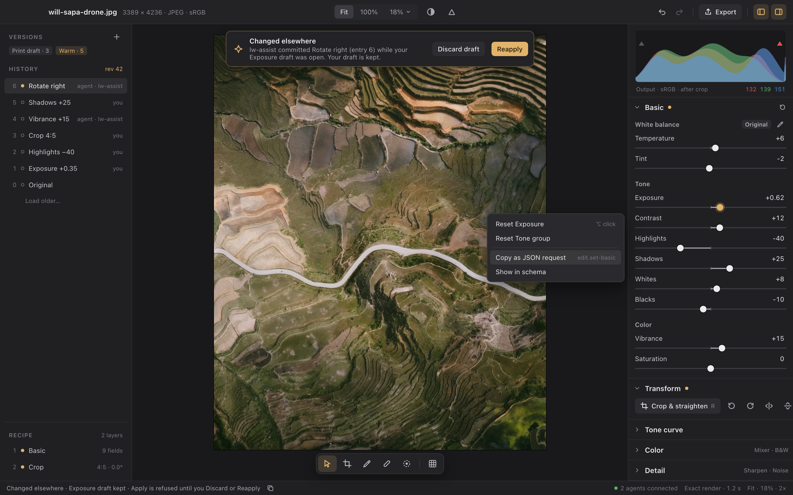
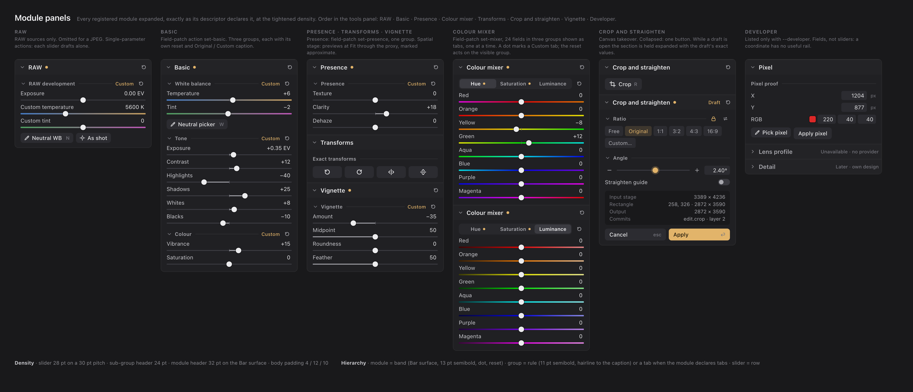

<h1 align="center">Lightwell</h1>

<p align="center">
  A fast, non-destructive photo editor for macOS, Windows and Linux.<br>
  Modular, hackable, programmable and open.
</p>

<p align="center">
  <a href="LICENSE"></a>
  
  
</p>

<p align="center">
  
  <br>
  <sub>The Develop workspace, from the design reference the app is built and checked against.</sub>
</p>

---

## Why Lightwell

Lightwell is a free, open-source, cross-platform photo editor. Its goal: meet or exceed the quality and experience of Adobe Lightroom—a benchmark that DHH once called "the last holdout" keeping him on macOS.

- **"The last holdout."** Lightwell aims for parity with leading commercial tools, so you never have to compromise on quality or workflow.
- **"Anything you can click, a program can do."** Every slider, crop handle, and action in the interface goes through the same command service as the JSON API. Scripts, plugins, and AI agents interact with the app just like a user does: if they warm up a photo, their edits appear in the same non-destructive history, clearly attributed.

## The pillars

These are the core principles that development follows. 

1. **Originals are sacred.** Source files are never modified. Edits are ordered layers in a recipe with immutable history. Incompatible data is refused, never quietly discarded.
2. **Everything is programmable.** Every operation has a discoverable, schema-described equivalent through the same command service. A GUI gesture is never the only way in, and UI/API parity is tested, not assumed.
3. **Fast, bounded and honest.** Responsiveness, bounded memory and image correctness are architectural requirements, measured on photo-sized inputs.
4. **Small core, deliberate extension points.** The core owns transactions, history and shared invariants. Tools own their own validation, controls and processing.
7. **Beautiful defaults, familiar feel.** A small, focused workspace that feels familiar if you've used Lightroom's Library and Develop.

## What it does today

Lightwell is pre-release. Everything is v0, formats change without migrations, and there are no packaged releases yet. With that said, a lot already works and has been checked on the reference machine (an M4 MacBook Pro):

- **Non-destructive editing** with ordered layers, persistent history, undo and redo, append-only restore, and named versions. Nothing in history is ever deleted.
- **Basic adjustments**: white balance with a neutral picker, exposure, contrast, highlights, shadows, whites, blacks, vibrance and saturation, each checked against an independent high-precision reference.
- **Presence** (texture, clarity, dehaze), an eight-range **colour mixer**, and a **vignette**.
- **Masks**: linear and radial gradients, brushes, and luminance and colour range selections that feed Basic, the colour mixer and Presence.
- **Crop and straighten**, rotate, mirror and flip, with exact integer transforms.
- **RAW editing** Nikon Z6, Fujifilm X100VI and DJI Air 2S DNG files are developed from sensor data, and changing the white balance later redevelops the RAW. It never works from a baked JPEG. Camera profiles are configured for 100 more models, each verified on one sample file; qualifying them properly is ongoing.
- **Presets**, including import of Lightroom Classic XMP and `.lrtemplate` presets, with a report of anything that couldn't be carried over.
- **An RGB histogram** with clipping overlays and a pixel readout.
- **Instant previews**: a quick preview first, then a cancellable exact render.
- **Live agents**: if a script commits an edit while you're mid-drag, Lightwell keeps your draft and asks whether to discard it or reapply it on top.

<p align="center">
  
  <br>
  <sub>An agent commits while you're dragging a slider. Your draft is kept until you choose what happens to it.</sub>
</p>

Export, relinking moved originals, an MCP adapter and a multi-photo library are the next big pieces. [Feature status](docs/features.md) has the full, current picture, including what hasn't been verified yet.

## Getting started

You'll need Rust (the toolchain is pinned) and a few platform prerequisites, listed in [development](docs/engineering/development.md). Then:

```sh
git clone https://github.com/Willyham/lightwell.git
cd lightwell
cargo xtask develop --open fixtures/s0/orientation-6.jpg
```

That builds an optimized editor and opens a sample photo. Use `--catalog path/to/catalog.sqlite` to keep your edits somewhere specific, or `--open` any JPEG or supported RAW file of your own. Lightwell only records a reference to the original and never copies or changes it.

The [user guide](docs/user-guide.md) covers the workspace, keyboard shortcuts and every tool.

## Scripting it

Every operation in the editor is a JSON request. You can talk to the running app, or start a headless owner of the same catalog and send it one request per line:

```sh
target/release/lightwell-json --catalog path/to/catalog.sqlite
```

```json
{"id":"schema","method":"schema.list","params":{}}
{"id":"expose","method":"edit.set-basic","params":{"asset_id":"asset-…","mutation":{"expected_revision":5,"request_id":"expose-1","actor":"my-script"},"exposure":0.5}}
```

`schema.list` and `module.list` describe every method with its parameters, ranges and defaults, so a client can discover what's possible instead of hard-coding it. Edits carry an expected revision, so stale requests are refused rather than silently applied, and a retried request with the same `request_id` is never applied twice. In the app, right-click any control and choose **Copy as JSON request** to get the exact call it makes.

## How it's built

<p align="center">
  
  <br>
  <sub>Tool panels are generated from each module's descriptor. The same descriptor generates its API.</sub>
</p>

Lightwell is written in Rust with a deliberately small core. The core owns the catalog, recipes, history and undo, rendering and the command service. Each tool (Basic, the colour mixer, crop and the rest) is a module that declares its parameters, controls and processing. The desktop builds its panels from those declarations, and the API generates `edit.*` methods from the same ones, so the two can't drift apart.

| Crate | What it holds |
| --- | --- |
| `lightwell-core` | Images, recipes, rendering, the SQLite catalog and history, preview scheduling, the JSON API |
| `lightwell-process` | CPU, memory and GPU counters for the editor process |
| `lightwell-raw` | RAW decoding and development |
| `lightwell-ui` | The widget library (built on [iced](https://iced.rs)), with no dependency on the core |
| `lightwell-app` | The desktop app and the headless `lightwell-json` binary |
| `xtask` | Every build, check, evidence and packaging command |

The editor tells you what it's doing. The Performance section shows memory, CPU and GPU use alongside whatever is running in the background, and the same numbers are available to any client through `resources.read` and `activity.list`.

<p align="center">
  
</p>

More detail is in the [architecture](docs/design/architecture.md) and [tool module](docs/design/modules-and-api.md) docs.

## Platforms

macOS on Apple silicon is the primary target and the only platform with native GPU verification so far. Windows 11 and Ubuntu 24.04 build and package in CI, but haven't had native desktop checks yet. See [platforms](docs/engineering/platforms.md).

## Contributing

Lightwell is developed in the open by a human owner working alongside coding agents, and the docs are written for both. Start with [AGENTS.md](AGENTS.md) for the pillars and working rules, then [CONTRIBUTING.md](CONTRIBUTING.md) for the layout and checks. Before handing off a change:

```sh
cargo xtask check
```

Useful reading:

- **Product:** [roadmap](docs/plan.md), [decisions](docs/decisions.md), [feature status](docs/features.md), [user guide](docs/user-guide.md)
- **Design:** [architecture](docs/design/architecture.md), [Develop workspace](docs/design/develop-workspace.md), [versions and lineage](docs/design/versions-and-lineage.md), [tool modules](docs/design/modules-and-api.md)
- **Specs:** [edit history](docs/specs/edit-history.md), [crop and export](docs/specs/single-image.md), [source recovery](docs/specs/source-recovery.md), [performance](docs/specs/performance.md)
- **Engineering:** [development](docs/engineering/development.md), [performance rules](docs/engineering/performance-rules.md), [dependencies](docs/engineering/dependencies.md)
- **Research:** [stack options](docs/research/technical-options.md), [Lightroom Classic](docs/research/lightroom/README.md), [darktable](docs/research/darktable/README.md)
- **Task plans:** [tasks](tasks/README.md)

## License

Lightwell is free software under the [GNU General Public License v3.0 or later](LICENSE). Third-party components keep their own licenses. A manual review of licenses, native dependencies and assets has been deferred and is not complete.
