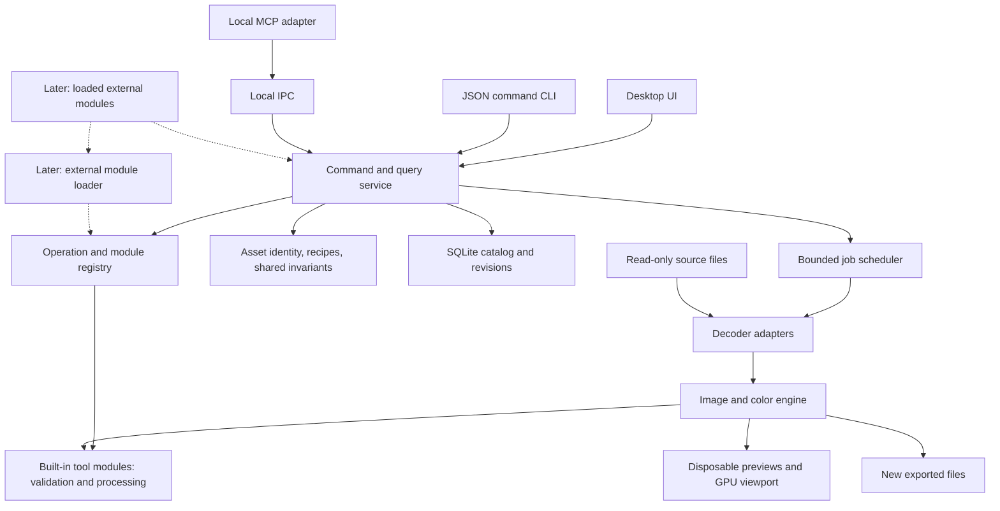

# Proposed architecture

Status: **implementation design draft; full programmability and a small module host are accepted requirements**. Linked implementation choices remain open. **S0** is the first cross-platform image-loading skeleton; **M1** is the subsequent one-image editor; **later** means a future v0 milestone. See [modules and API](modules-and-api.md) for D19–D21, and [plan](../plan.md) and [research](../research/technical-options.md) for rationale and primary sources.

## Skeleton first

S0 implements only the window, shared open-image service, bounded decoder and Fit image surface, with configuration, diagnostics and a development state/capture harness. No database or editor recipe is needed. Use the [bootstrap contract](../specs/bootstrap.md) and [development workflow](../engineering/development.md). The diagram below is the M1 target architecture, not a requirement to scaffold every box before displaying an image.

## Boundaries

Use one repository and a small Cargo workspace if Rust is selected. For S0, create only the application and UI-independent image/service boundaries that contain real code. For M1, a possible four-crate layout is `lightwell-core` (types, validation, geometry), `lightwell-engine` (decoding, color, rendering), `lightwell-catalog` (persistence), and `lightwell-app` (service orchestration, desktop and CLI entry points). These are proposed names, not existing paths. Add persistence, IPC, MCP and plugin boundaries when their milestone needs them.

The UI owns transient focus, layout, and pointer gestures. The application service owns durable state transitions and jobs. Feature modules own their parameter validation and processing semantics; the core supplies registration, shared invariants, recipe/history transactions and undo/redo. Rendering consumes immutable recipe snapshots through the registered providers. No panel or module edits database rows or holds a separate authoritative undo history. Logical modules do not require separate crates or dynamically loaded binaries.

## Originals, catalogs, and recipes

**M1 agreed:** import by reference. A catalog records an existing file's location and identity; it does not move or copy the photo. The active database and cache live on local storage. A catalog is not a backup of originals. Managed copy-on-import and sidecars remain separate decisions; recovery from externally moved originals is a core design concern.

Proposed persisted entities:

| Entity | Purpose |
| --- | --- |
| Asset | Stable ID, source locator, dimensions, orientation, format, metadata, source fingerprint, and availability |
| Edit state | Asset ID, current recipe, monotonically increasing revision |
| Edit history entry | Stable ID/sequence, semantic action and parameters, actor/request/timestamp, base/result revision, immutable recipe snapshot and navigation/restore relationships |
| Catalog metadata | Internal format marker and project settings |
| Later: collections, ratings, labels and saved filters | Indexed organization primitives, added when scoped |

Keep searchable fields in typed indexed columns. Store the small recipe payload as structured data. Do not put original pixel data in SQLite. Start with ordinary tables and atomic state/history transactions, not event sourcing as the only way to reconstruct current state.

Source paths are locators, not stable IDs. Preserve non-UTF-8 OS paths internally where supported and use an explicit lossless external representation; display names are separate. Compare filesystem identity to handle aliases. Use size/mtime as cheap change hints and a streamed content hash when needed. Full-library hashing must be cancellable and off the startup path. M1 import can hash its single asset during background decoding; verify identity before using cached pixels or exporting.

Store roots separately from relative paths from the first catalog. Manual Locate is agreed for M1: verify the selected file and atomically reconnect it to the existing asset and edits. Do not infer that a new file at an old path is the same image. The [source recovery specification](../specs/source-recovery.md) defines identity, ambiguity, external-copy matching and failure states; folder recovery and automatic detection follow later.

Each durable command validates first, then commits recipe and history in one transaction. A failed commit leaves the previous state authoritative. Preserve a user-visible unsaved draft when practical. Use foreign keys, short transactions, and deliberate WAL/checkpoint settings; test recovery and disk-full behavior. Catalog backup uses SQLite's consistent snapshot mechanism. Never make copying a live `.sqlite` file the documented backup method.

Internal format markers and backups protect v0 data. They do not imply a public API compatibility promise or a large migration framework. Incompatible data must be rejected with a recovery path rather than silently reset.

## Geometry and non-destructive state

A recipe records intent: orientation adjustments, angle, crop, and later color parameters. Cache contents are derived from the source identity and complete recipe, never the source of truth.

Keep pointer motion as an in-memory draft. Commit once per completed gesture or explicit Apply action. Every committed image change enters the core-owned persistent action log. Undo/redo, history browsing, arbitrary-entry preview and restore use its saved recipes; they never reverse lossy pixel transformations. A new edit may invalidate shortcut redo availability but must retain all historical entries and states. UI and agent commits share semantics and provenance. See the [history contract](../specs/edit-history.md); completed product TASK-070 records append-only Restore and retained history, verified before TASK-064 closes. The log plus current recipe can use ordinary tables and snapshots without a generalized event-sourcing system.

The image's full edit geometry is independent of viewport zoom, panel position, display DPI, and preview resolution. M1 includes viewport pan, numeric zoom percentage and Fit; these are session/view state accessible to agents and do not alter the exported crop. [The single-image specification](../specs/single-image.md#geometry-contract) defines free handles, centered Option resizing and crop constraints before implementation.

## Image pipeline and color

**M1:** probe/decode JPEG → interpret EXIF orientation and embedded RGB profile → color conversion → geometry sampling → display conversion or JPEG export. Decode and render behind interfaces that carry dimensions, orientation, profile/color meaning, and errors, rather than returning an unlabelled byte buffer.

Propose linear Rec.2020/D65 as the RGB working space and float32 as the correctness reference. Retain above-white and negative values where operations permit; clip/map deliberately at output. Validate this choice during the color probe. Do not allocate a full float32 image solely because the type is floating point: process bounded regions/strips and use reduced-resolution previews. GPU float16 intermediates are a later, measured optimization with explicit error tests.

RGB/greyscale JPEG with a valid supported profile is converted through the selected color library. An untagged JPEG is treated as sRGB with that assumption exposed in metadata. Unsupported CMYK/YCCK or unusable profiles produce a clear unsupported-format/profile result in M1. Never silently interpret tagged wide-gamut pixels as sRGB.

Export options include Keep metadata, default off. Use the same sanitized metadata reader/writer policy for UI and programmatic exports: optional source information is omitted by default, supported descriptive fields can be retained explicitly, and output color/orientation/dimensions are always correct. Freeze the effective option in each export job without changing the original or its edit recipe.

The display path needs a documented contract with the OS surface/compositor: either provide correctly tagged content for system conversion, or convert to the target display space in the app with appropriate surface behavior. Do not do both accidentally. Test moving between displays, profile changes, and an explicit/manual profile path where automatic discovery is unavailable. HDR presentation and soft proofing are future work; this first contract is SDR.

Later RAW decode produces sensor data and camera metadata, not generic sRGB. RAW preparation handles levels, relevant white-balance placement, demosaic, and camera color before the common RGB stages. The initial RAW development order must be specified with the selected algorithm; do not force sensor-domain operations into a JPEG pipeline. Embedded camera previews use a separate, labelled path and are replaced by developed pixels for editing.

Initial RAW fixtures target Nikon Z6 and Fujifilm X100VI in the owner's actual recording modes. Keep the decoder boundary replaceable. Profile library decoding separately from demosaic/color and compare established alternatives before a targeted patch, fork or custom decoder. A new library remains a possible response to measured gaps, not a prerequisite for Lightwell.

Later tonal tools use a fixed documented processing order independent of panel order. Exposure, highlight recovery, tone mapping, local contrast and output transfer are not interchangeable stages. Texture, clarity and dehaze require separate visual/numerical specs, neighborhood/scale handling, and tests for tile seams and halos. They are not just cheap shader sliders.

## Jobs, caches, and memory

Run file I/O, hashing, decode, export, and database batches away from the UI thread. Bound CPU worker concurrency and job queues by both count and estimated bytes. A generation number on preview requests allows dropping stale results. Give selected-image interaction priority over adjacent-image prefetch and bulk indexing; export cannot starve interaction.

M1 uses a screen-sized Fit preview and source-resolution pixels for the visible region at 100% inspection. A bounded full-resolution texture where supported, or a viewport-region render from the decoded source, can satisfy the M1 editor; a persistent tile pyramid is not required. Do not represent an enlarged Fit texture as finished detail. Query GPU texture limits and select a bounded upload/render path. Bound decode allocation using dimensions and checked arithmetic. Images outside the tested resource envelope fail cleanly with a useful limit message. CPU export can use a decoded source plus bounded working strips; do not require a second full-resolution float image.

Later add reusable image pyramids, tile caches for efficient detail browsing, bounded LRU caches, and a disk quota. Cache keys include source content identity, decoder/processing build identifiers, recipe digest, resolution, and relevant color transforms. Display-specific output must not be reused across different monitor profiles. Store files in sharded directories initially; only add a cache database/packed store after measuring filesystem overhead.

Viewport-sized requests make drawing cost independent of total catalog size. A virtualized grid requests visible rows plus bounded prefetch. Use keyset/cursor pagination for indexed sorts instead of deep OFFSET walks. Count queries and low-selectivity search need separate budgets. Future AI indexing runs incrementally at background priority; it does not become an import prerequisite.

## Agent contract

**Accepted for the whole product:** every application operation, including all bundled and external photo-editing tools, must be callable by programs/agents. Exposure, white balance, masks and clone strokes are explicit future examples, not additions to M1. Semantic actions, settings and module lifecycle must be exposed when introduced; requiring GUI gestures is not API support. [The coverage contract](modules-and-api.md#what-an-operation-means) defines feature registration and reproducible inputs.

**M1 agreed:** one typed command/query service exposed through JSON CLI and MCP, with live agent control while the GUI is open. Operation families include catalog create/open, asset import/list/get, edit get/set geometry/reset/undo/redo, history list/inspect/preview/restore and return-to-current, preview render, export, and job get/cancel. Schemas include units, ranges, coordinate conventions, defaults, preconditions, and structured errors. Also expose capabilities so programs can discover what this build actually supports.

Use a persistent JSON command-session mode and a separate standards-compliant MCP stdio adapter, both with clean protocol stdout and diagnostic stderr. The adapters connect to the catalog owner. Optional one-shot CLI wrappers wait for completion. Disconnecting one client does not close the GUI or cancel another client's work; cancellation is explicit. When the owner exits, stop accepting work, cancel unfinished jobs safely, finish/roll back active catalog commits and release ownership. Do not promise durable export resumption in M1; clients reconnect and inspect revision/job state rather than blindly repeating a mutation.

Mutations include an expected revision and request ID. Conflicting revisions return the current revision without applying a partial edit. Request IDs make retrying import, rotation, or export safe within a documented retention scope; never advertise unlimited exactly-once execution. A multi-parameter geometry update is atomic. Transient UI gestures are not hundreds of commands.

Enforce one application-level catalog owner and route clients to it; a second process must not independently maintain undo state. In M1 the GUI can own the catalog and service all CLI/MCP clients. With no GUI owner, a headless session may acquire ownership and serve the same operations. Seamless transfer from an active headless owner into a GUI is not required for M1: return an explicit ownership conflict on that reverse launch path rather than creating two owners.

Local IPC uses Unix-domain sockets on macOS/Linux and a Windows named-pipe adapter when validating that platform. Restrict endpoints to the current user and verify the peer/endpoint belongs to the intended owner. No network listener by default. Bound frame sizes, clients and queued requests. The GUI receives committed changes and job progress; events carry a sequence/revision so reconnects can refresh a full state snapshot. Agents request size-bounded previews rather than entire RAW buffers.

If an agent commits while a human has an unapplied crop draft, keep the draft and its base revision, show the external change, and require discard/reapply against current state. Do not silently replace either edit. A stale expected revision fails without mutation. Human and agent commits appear in the same history and can be undone through either interface.

Generate/adapt MCP tools from the same command descriptions; keep protocol behavior in the adapter and verify with the selected SDK/client. UI, CLI and MCP must reach the same recipe/output for the same operations. Expose meaningful session selection/view state in M1 so agents can identify and display the current image; framework focus and pointer events do not become public editing commands.

No AI model is required to run the app. Local or remote agents are clients. Image upload, external services, arbitrary shell execution, and original deletion are not hidden side effects of editing operations.

## Extension path

The core is a small shell/module host with shared non-destructive services, not the implementation of every tool. External module loading is an accepted product requirement; runtime, packaging and first use case remain open. [The module design](modules-and-api.md) separates logical modularity, runtime enablement, lazy initialization and binary loading.

1. **M1:** built-in decoder and geometry modules, with identifiers, parameter definitions, validators and rendering boundaries using host-owned transactions/history. No dynamic loading or optional-module settings requirement.
2. **Later:** user-customizable panels and optional feature modules where useful. Keep lightweight built-ins linked and lazily initialize expensive resources as the engineering recommendation; verify savings before splitting core functionality into plugin binaries. Hidden panels do not remove recipe stages.
3. **Scoped external proof:** select the use case in product TASK-033, then benchmark activation and plan the actual loader in implementation TASK-067. Load a separately authored module without host source changes and expose its operations through shared APIs. External scripts alone do not satisfy this proof. WASM is a candidate for suitable workflow logic, not a selected runtime.
4. **Separate future investigation:** image-processing extensions, native workers and GPU operations, with explicit pixel formats, region/halo needs, resource budgets, cancellation and failure behavior. No general graph or marketplace is needed.

Extensions use host commands for catalog mutations; they do not issue arbitrary SQL. Unknown, disabled or missing processing tools preserve serialized settings and history and report the unavailable effect. Block final export rather than omit an effect. A small default workspace must remain useful with every optional extension disabled. Required core services cannot be disabled; module lifecycle operations and dependency failures are themselves programmable.

The owner's preferred ecosystem is open source only. Plan for compatible open-source bundled and official extensions, with GPL-3.0-or-later as the selected core license. Do not assume that calling the API automatically changes an independent client's license; settle actual integration obligations when specifying the extension mechanism.
