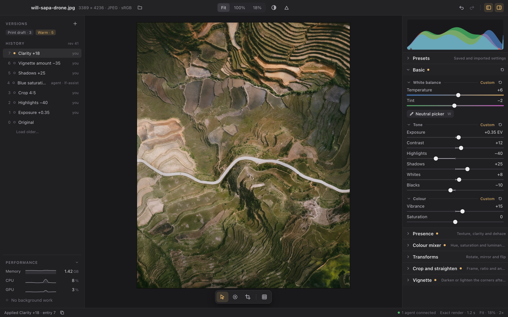

# Develop workspace

Status: implemented and verified on the M4 Mac for the shell, the widget library, the generated panels, the canvas modes, the draft-backed slider gesture and the neutral picker's sample-apply pick, over the modules that exist today (pixel, Basic, RAW, transform, crop), and for the histogram inspector with its clipping overlays and pointer readout, under the [architecture](#architecture) below. The Basic section is complete: White balance, Tone and Colour with their group resets and the picker. The export, Locate, heal and mask tools the mockups also show are not built, and their rows in the tool array say so. This is the design for the single-image editing screen: what it shows, how the tools are arranged and how they behave. Library, catalog management and settings are out of scope. The owner's decisions are recorded in [decisions](#decisions) and in [product decisions](../decisions.md#develop-workspace).

## Mockup

Rendered at 1440 × 900 logical points, 2× scale, from the design artboards, rebased on 2026-09-22 to the modules the registry holds today (RAW, Basic, Presence, Colour mixer, Transforms, Crop and straighten, Vignette, and Pixel under Developer). The photograph is the owner's Sapa drone JPEG from the fixtures; the slider values, history and agent are illustrative. The boards draw the [density and hierarchy](#module-panels) the built tools panel implements; everything else they show is delivered. Rendered evidence of the built screen comes from `cargo xtask smoke --scenario workspace`, `--scenario histogram` and `--scenario unavailable` (see [verification](#verification)).

| Board | Shows |
| --- | --- |
| [Default](develop-workspace/default.png) | The workspace with Basic expanded and the five other sections collapsed under it, history and recipe on the left, mode strip under the photo |
| [Module panels](develop-workspace/module-panels.png) | Every registered module expanded, exactly as its descriptor declares it, at the implemented density, with the mixer's groups as tabs: the reference for each section's layout |
| [Crop draft](develop-workspace/crop-draft.png) | Crop mode: dimmed overlay, thirds, handles, the draft bar and the Crop section held expanded with the exact values it would commit |
| [Changed elsewhere](develop-workspace/changed-elsewhere.png) | An agent commits during a slider gesture: the conflict notice, actor-attributed history and a control's Copy as JSON request menu |
| [Components](develop-workspace/components.png) | Slider states, the module and group hierarchy, history rows, canvas modes, notices and the command palette |

One render per module, cropped to its panel at 300 pt, is kept under [develop-workspace/modules](develop-workspace/modules): `raw`, `basic`, `presence`, `colour-mixer` (all three tabs), `transforms`, `crop-and-straighten` (idle and drafting), `vignette`, `developer-pixel` and `states` (collapsed, unavailable and later bands). They are the per-section references for the [Module panels](#module-panels) design.

## Principles

- **The photograph is the only colour on screen.** Chrome is neutral grey in a few tonal steps; one warm accent marks the current state and the active mode; red and blue are reserved for clipping.
- **State on the left, tools on the right.** The left panel answers "what has happened to this photo" (history, versions, the recipe). The right panel answers "what can I do" (histogram, modules). The canvas between them is the photograph and nothing else until a mode needs an overlay.
- **Adjustments and modes are different things.** An adjustment module (Basic, later Tone curve, Detail) is a stack of controls that commit on release. A canvas mode (Crop, later Heal and Mask) takes over the canvas, runs a draft and ends with Apply or Cancel. The screen shows which kind is active and never mixes their commit rules.
- **Every visible control is an API call.** The panel is generated from module descriptors, history rows name their action and actor, and any control can hand you its JSON request. Nothing in the design is a GUI-only gesture.
- **Nothing is hidden and nothing is modal.** Unavailable providers, stale previews, conflicts and missing originals appear as notices over the canvas with the explicit actions the core allows. Editing is disabled only when the core disables it, and the status bar says why.

## Layout

At the reference size (1440 × 900 logical points on the M4 MacBook Pro) the screen has five regions. The two side panels collapse independently; the canvas takes whatever remains.

| Region | Size | Contents |
| --- | --- | --- |
| Title bar | 44 pt | File name and dimensions, Open; centred view control (Fit, 100%, typed percentage) and Compare; Clipping, Undo, Redo and the two panel toggles. Export arrives with its own feature |
| State panel (left) | 240 pt | Versions as chips; History as one row per entry (sequence, marker, action label, actor); Recipe as the ordered layer stack |
| Canvas | remainder | Photograph centred at Fit or scrolled at a percentage, on the darkest surface; a floating mode strip at the bottom; notices and a draft bar at the top |
| Tools panel (right) | 300 pt | The histogram inspector, then one collapsible section per registered module, then a Developer section when `--developer` lists test modules |
| Status bar | 26 pt | Status message with Copy; connected clients; render state and time; zoom and display scale |

The mode strip holds the pointer, one entry per registered module whose canvas declaration takes the photograph over (crop today; heal and mask when their modules exist) and the view overlays (thirds). It floats over the canvas so it stays next to the photograph when the panels are hidden. A pick mode is not a canvas takeover and is not listed here: a module that declares a `point-pick` or `sample-apply` canvas declares a `picker` control too, and that button lives in the module's own panel beside the controls the pick fills.

## Tool array

Where each tool lives, what kind of thing it is and whether it exists. Kinds: **module** sections render from descriptors in registry order; **mode** entries come from a module's canvas declaration, and a takeover mode is also a mode-strip entry while a pick mode is reached from its module's own `picker` control; **view** and **core** items are host features that need no module.

| Tool | Where | Kind | Status | Programmable through |
| --- | --- | --- | --- | --- |
| Fit, 100%, typed zoom, pan | Title bar, Space-drag | view | Implemented | `view.set` |
| Compare with original (hold `\`) | Title bar | view | Implemented | `preview.select` and `preview.return-current` on the Original entry; refused while a draft is open |
| Histogram, clipping triangles and overlays, RGB readout | Top of tools panel, `J` | core inspector | Implemented | `analysis.request` / `analysis.read`, `workspace.set` `clip_shadows` and `clip_highlights`, `render.sample` |
| Presets: the library by group, a Partial badge with the import report's counts, apply on click, a create form, file import, and a row menu with Export, Copy import report and Delete | Tools panel, first section, collapsed | module (host-rendered `presets` control) | Implemented ([design](presets.md#desktop)): a click is one `edit.apply-preset` through the ordinary action path; rows are disabled with no photograph, while a request is in flight, during a historical preview and while a draft is open; another client's `preset.*` event refreshes the library in the same event poll | `edit.apply-preset`, `preset.list`, `preset.capture`, `preset.create`, `preset.import`, `preset.read`, `preset.export`, `preset.delete` |
| Basic: White balance (Temperature, Tint), Tone (Exposure, Contrast, Highlights, Shadows, Whites, Blacks), Colour (Vibrance, Saturation), with a reset per group | Tools panel, after Presets | module | Implemented: each generated slider drafts, previews live and commits once on release; each group header carries its own reset and reads Original or Custom | `edit.set-basic`, `edit.reset-basic` and `draft.begin/set/commit/cancel/reapply` |
| Basic neutral picker (`W`) | Tools panel, White balance group | mode | Implemented: a click samples the photograph and commits the white balance that neutralises it, once | `workspace.set` for the mode, then `query.neutral-sample` at the located content pixel and `edit.set-basic` |
| RAW sensor neutral picker (`N`) | Tools panel, RAW group, RAW sources only | mode | Implemented: a click on a RAW photograph commits the sensor white balance that neutralises that pixel | `workspace.set` for the mode, then `edit.pick-raw-neutral` at the located content pixel |
| Transform: Rotate left/right, Mirror, Flip | Tools panel | module | Implemented (M2, M3) | `edit.transform` |
| Crop and straighten: free handles, ratio presets, lock and swap, angle, straighten guide, reset | Mode strip, `R`; Crop section while drafting | mode | Implemented (M4) | `edit.crop`, `edit.crop-fit`, `edit.crop-reset` |
| Tone curve | Tools panel, collapsed | module | Later | Its own design |
| Colour mixer: Hue, Saturation and Luminance for eight colour ranges | Tools panel, collapsed, after Presence | module | Implemented ([design](presence-mixer-vignette.md)); B&W mix is later | `edit.set-mixer`, `edit.reset-mixer` and the draft lifecycle |
| Detail: sharpening, noise reduction | Tools panel, collapsed | module | Later | Its own design |
| Presence: Texture, Clarity, Dehaze | Tools panel, collapsed, after Basic | module | Implemented ([design](presence-mixer-vignette.md)) | `edit.set-presence`, `edit.reset-presence` and the draft lifecycle |
| Vignette: Amount, Midpoint, Roundness, Feather | Tools panel, collapsed, after Crop | module | Implemented ([design](presence-mixer-vignette.md)) | `edit.set-vignette`, `edit.reset-vignette` and the draft lifecycle |
| Heal, Mask | Mode strip | mode | Later | Their own designs |
| History, Undo, Redo, preview, Restore, Load older | State panel, title bar, shortcuts | core | Implemented (M1) | `history.list`, `history.inspect`, `history.undo`, `history.redo`, `history.restore`, `preview.select` |
| Versions: save, select, delete | State panel | core | Implemented | `version.create`, `version.list`, `version.delete` |
| Recipe (layer stack) | State panel | core | Implemented as rows | `recipe.describe` |
| Export | Title bar | core | Editor follow-up | The export design |
| Locate | Notice on a missing original | core | Editor follow-up | [Source recovery](../specs/source-recovery.md) |
| Module settings, resources, activation, tasks and consent | Tools panel, a capability block at the top of the module's section; consent notices over the canvas | core | Implemented for any module that declares them (today only the developer capability proof): Status and Settings views, Download, Activate, a task button with progress and Apply, Allow / Don't allow | `module.settings.*`, `module.profile.*`, `module.permission.*`, `module.activate`/`deactivate`/`status`, `module.resource.*`, `module.job.*`, `task.<id>` ([module capabilities](module-capabilities.md)) |
| Command palette (`Cmd+K`) | Overlay | core | Implemented | Every listed module's `module.list` controls, resets and canvas modes, one `Apply preset: <name>` per library preset that can apply, plus the host view, history and panel commands |
| Copy as JSON request | Control context menu, the crop draft's Apply | core | Implemented | The control's generated action, or `edit.crop` for the open draft |
| Show in schema | Control context menu | core | Later | Its own design |
| Pixel proof | Developer section, listed only with `--developer` | module | Implemented (M1) | `edit.set-pixel` |

A build shows only the modules its registry contains. Sections for later modules exist in the mockup to settle their place in the panel, not as placeholders in code; the desktop never lists a module that is not registered. The pixel proof tool is a test module: its descriptor is marked `developer` and the desktop lists it under a Developer section only when launched with `--developer`, so the default workspace stays a photo editor. `--disable-module ID` registers a built-in as unavailable, which is how the unavailable-provider state is demonstrated.

## Module panels

Status: implemented and verified on the M4 Mac on 2026-09-23 against the [Module panels board](develop-workspace/module-panels.png) and the per-module references in `develop-workspace/modules/`, with the differences that remain listed under [what is not matched](#what-is-not-matched). This is the exact design of each section the tools panel generates, in registry order, from the descriptors `module.list` returns. The desktop's job is to lay the modules' own controls, ranges, steps, units, zero points, rails, groups and resets out at one density with one hierarchy. The descriptors declare what the layout needs through the existing vocabulary: `temperature` and `tint` [rail hints](ui-components.md#parameter-kinds-and-hints) on Basic's and RAW's white-balance sliders, icon names on the four transform actions and on RAW's As shot, `style: field` on the pixel proof's X and Y, `collapsed` on Presence, the mixer, Transforms, Crop and straighten and Vignette, and the module-level `layout: tabs` the colour mixer declares so its three groups render as tabs. A layout hint changes only what a client draws, never what the host accepts, which is the vocabulary's rule for every hint.

### Density

The rows are tight enough that a panel of many sliders stays scannable and every section header stays on screen at the reference size. Every size below is a `theme.rs` constant pinned by a widget test, so all uses of a widget move together.

| Element | Size | Rule |
| --- | --- | --- |
| Slider row | 28 pt on a 30 pt pitch: 14 pt label line, 2 pt gap, 12 pt rail line | The value sits on the label line, right-aligned in a 48 pt box, unit once; the rail line holds the 2 pt rail, the 1 × 6 pt zero tick (only for a zero inside the rail) and the 12 pt thumb with a 1 pt dark ring. A dragged thumb loses the ring and gains an 18 pt accent halo |
| Sub-group header | 24 pt, 4 pt above | 11 pt semibold secondary text, then a hairline rule to the Original or Custom caption and the group's reset |
| Module header | 32 pt band, 1 px border above | 13 pt semibold on the Bar surface, disclosure, title, dot, and the hint (collapsed, truncated with an ellipsis) or the reset (expanded) |
| Section body | 4 pt top, 12 pt sides, 10 pt bottom | Sliders are separated only by their 2 pt gap; groups by their header's 4 pt margin |
| Button rows | 22 pt compact buttons in a row that holds a picker, 26 pt otherwise; 4 pt above, 2 pt under a group header | Picker and action buttons inside a group are a row under its sliders; a run of actions that all name an icon is one row of equal icon buttons |
| Tab row | 24 pt segmented control, 4 pt above and below, semibold labels | Replaces the group headers of a module that declares `layout: tabs`; one tab per group, the selected group's reset at the row's right |
| Colour rails | Mixed in sRGB, drawn at 85% over the panel | A declared gradient rail replaces the fill |
| History rows | 26 pt on a 28 pt pitch | Same text sizes; the label truncates with an ellipsis before the actor does |

Section heights at 300 pt wide, measured on the built panel and equal to the references: Basic 465 pt, Presence 165, Colour mixer 319 whichever tab is selected, Transforms 105, Crop and straighten 77 idle, Vignette 195, RAW 193, any collapsed section 33. The acceptance for the density: at 1440 × 900 with Basic open, the histogram, Basic and all five other headers are on screen at once, which `basic-panel` checks on its opened frame.

### Hierarchy

Three levels, each with one visual device, so a person can tell a module from a group from a control without reading:

- **Module = band.** The header row sits on the Bar surface (`#232326`) against the Panel body (`#202023`), with a 1 px border above. Expanded or collapsed, the band is the same height, so the panel does not jump. The band carries the disclosure, the title, the accent dot when the module has a non-neutral layer, and either the hint (collapsed) or the module reset (expanded). An unavailable module's band shows its reason in the clipping red and does not expand.
- **Group = rule.** A sub-group header is 11 pt semibold secondary text followed by a hairline rule that runs to the caption. The rule is what separates groups from the sliders above them without a second background. The caption reads Original or Custom for a field-patch group, Custom in the accent, and the group's reset sits after it. A collapsed group keeps its header and drops the rule.
- **Tabs = alternative groups.** A module whose groups are parallel views of one set of controls, such as the mixer's Hue, Saturation and Luminance over the same eight colours, declares `layout: tabs` and the desktop draws its groups as one segmented row instead of stacked headers: one group visible at a time, a dot on every tab whose group is Custom so a hidden group's edits stay visible, and the visible group's reset at the row's right. The selected tab is per-client view state, like a collapsed group; it changes no recipe, and every group's fields keep their API. Stacked groups remain the default and stay right for Basic, whose groups are different controls rather than views of the same ones.
- **Control = row.** Sliders, fields and button rows sit flush inside the group with no indent; the group rule above and the module band around them are the only structure. A declared gradient rail replaces the fill on its slider, so a rail's colour is always the module's declared meaning and never a state.

### Sections

Order and content are the registry's. "Patch" means the group's sliders are fields of one field-patch action, so each drafts on the 16 ms tick and commits once on release; "single" means each slider is the only parameter of its own action and drafts the same way; "request" means the fields are inputs to an action run by a button.

| Section | Shown | Groups and controls | Resets | Modes and buttons | History label · recipe row |
| --- | --- | --- | --- | --- | --- |
| **RAW** (`lightwell.raw`) | RAW sources only; omitted for a JPEG, not disabled | **RAW development** (single): Exposure −5.00..+5.00 EV step 0.01; Custom temperature 2000..12000 K step 10, default 6504, unipolar from the minimum, `temperature` rail; Custom tint −100..+100, `tint` rail | Group and module: `reset-raw` | Neutral WB picker (`N`, `pick-raw-neutral` at the located pixel) and As shot (`use-as-shot-wb`), as one button row under the sliders. Red and blue gain are API-only actions with no control | Action title · the development's values |
| **Basic** (`lightwell.basic`) | Always; expanded by default | **White balance** (patch): Temperature −100..+100 with the `temperature` rail, Tint −100..+100 with the `tint` rail. **Tone** (patch): Exposure −5.00..+5.00 EV step 0.01, Contrast, Highlights, Shadows, Whites, Blacks −100..+100. **Colour** (patch): Vibrance, Saturation −100..+100. All bipolar from 0 | Each group its own preset reset; module `reset-basic` | Neutral picker (`W`, `sample-apply` through `neutral-sample`) as a button row under the White balance sliders; it reads selected while the mode is active | `Shadows +25` · `10 fields` or the non-neutral ones |
| **Presence** (`lightwell.presence`) | Always; collapsed | **Presence** (patch): Texture, Clarity, Dehaze −100..+100, zero 0 | Group preset; module `reset-presence` | None. A Fit preview through the proxy is marked approximate in the status bar, as [instant preview](instant-preview.md) records | `Clarity +18` · `Clarity +18` |
| **Colour mixer** (`lightwell.mixer`) | Always; collapsed | Three groups as **tabs** (`layout: tabs`), Hue selected by default: **Hue** (patch): eight sliders Red, Orange, Yellow, Green, Aqua, Blue, Purple, Magenta, −100..+100, each with its declared three-stop hue rail. **Saturation** (patch): the same eight with grey-to-colour rails. **Luminance** (patch): the same eight with dark-to-light rails. One group visible at a time; a dot on a tab whose group is Custom | The visible group's preset reset at the tab row's right; module `reset-mixer` | None | `Blue saturation −6` · `3 fields` |
| **Transforms** (`lightwell.transform`) | Always; collapsed | **Exact transforms**: four `action` controls with presets, rendered as one row of four icon buttons (rotate left, rotate right, mirror, flip) with tooltips, since each is a single exact operation and the labels are their icons | None declared | None | `Rotate right` · `Rotate right` |
| **Crop and straighten** (`lightwell.crop`) | Always; collapsed | Idle: one Crop button (`R`) that enters the takeover mode. Drafting: **Ratio** with the seven `aspect` chips, lock and swap, and the custom width and height fields; **Angle** with the −45..+45° stepper (±0.5 nudges), its rail and the Straighten guide toggle; the exact readout (input stage, rectangle, output, what Apply commits); Cancel and Apply | Module `crop-reset` from the header | The mode strip's Crop entry and the draft bar are the same draft | `Crop 4:5` or `Crop 2.4°` · `4:5 · 0.0°` |
| **Vignette** (`lightwell.vignette`) | Always; collapsed | **Vignette** (patch): Amount −100..+100 zero 0; Midpoint 0..100 default 50, unipolar; Roundness −100..+100 zero 0; Feather 0..100 default 50, unipolar | Group preset; module `reset-vignette` | None | `Vignette amount −35` · `−35 · 50 · 0 · 50` |
| **Developer · Pixel** (`lightwell.pixel`) | Only with `--developer` | **Pixel proof** (request): X and Y as labelled fields in px (no rail: a coordinate has no useful one), RGB as three fields with a swatch, Pick pixel (`point-pick`, fills X and Y) and Apply pixel | None | The picker sits beside the fields it fills | `Pixel 12, 34` · `Pixel 12, 34` |

Sections for modules that do not exist (Tone curve, Detail, Lens profile, Heal, Mask) are not drawn in the default board. The Module panels board shows one unavailable band and one later band under Developer only to fix how those states look.

### What is not matched

Measured against the references on 2x captures; each is either something Iced cannot draw or a difference the references themselves do not settle:

- **Framing.** A reference card counts its 1 pt border inside 300 pt, so left-anchored items sit 1 pt left and right-anchored items 1 pt right of the reference.
- **Text.** The workspace draws [Inter](../engineering/dependencies.md) where the references were drawn in the system face: glyphs sit about 0.1 em higher in their line, labels are a few percent wider, and figures are proportional because Iced cannot request `tnum`. Collapsed hints that no longer fit end in an ellipsis. Values show a hyphen-minus where the references draw "−", because the display strings and the history labels come from the same formatting.
- **Disclosure chevrons** follow what a group can do rather than the drawings: Transforms' and Pixel's groups keep theirs because they collapse, and crop's Ratio and Angle draw none because they cannot.
- **Buttons.** The references draw Apply pixel 26 pt beside a 22 pt Pick pixel; the rule is per row, so it renders 22 pt and the Pixel section is 4 pt shorter.
- **Crop.** The drafting section keeps the custom width and height fields as a row under the chips (the reference shows only the Custom chip), and the angle reads "2.4°" because the crop descriptor declares no display precision.
- **RAW.** Its group is single actions, not a field patch, so it has no Original or Custom caption.
- **Whole screens.** The histogram inspector is 76 pt taller than in the default board, because its spec keeps the domain line and three count rows; the recipe rows stay two lines, as their own design records; the title bar and photograph are the fixture's.

## Panels

### State panel

- **Versions** are chips: name and entry number. The chip for the displayed entry is tinted. Selecting one previews that entry; the plus button reveals a name field and Save for the displayed state. Delete is in the chip's context menu, an inline menu under the chips.
- **History** lists newest first: sequence number, a marker, the stored label and the actor. The label is the action's rendered `summary` template when the module declares one ("Crop 16:9", "Rotate right", "Pixel 12, 34") and the action title otherwise. Markers: filled accent for the current entry, an accent outline for a previewed entry, hollow for the rest. Undone entries stay in the list, dimmed and labelled branch. Load older appears when a page remains.
- **Recipe** lists the layer stack in stored order with the module title and the module's own payload summary from `recipe.describe` ("Rotate right", "61% × 80% at 3.5°", "Whole image"); a layer whose provider is unavailable shows the reason instead. It is the durable order of processing, which is why it lives with history and not with the tools: the panel order on the right never changes it.
- During a historical preview the panel shows Return to current and Restore under the list and the tools panel is disabled with its values still visible, matching the current behaviour.

### Tools panel

- The **histogram** sits above the first module section with no header of its own: a 96 pt plot of the three channels as filled, overlapping polygons on one shared linear vertical scale (the largest count in any channel), then one caption row naming the domain ("Output · sRGB · after crop") with the pointer readout and any status notice appended to it, then three rows of endpoint counts in words for a reader who cannot measure the plot. It describes the rendered SDR sRGB output of the whole composition, after crop and edits, so panning, zooming and display scale never change its population. Pending, updating (a stale result still shown while a newer frame renders), and unavailable with its reason are explicit, never a silently empty plot: each joins the caption row after the domain, and the three count rows stay where they are, showing a dash instead of numbers while there is no report rather than zeros that would read as "nothing is clipped". The inspector therefore occupies the same rows whatever it has to say, which is what keeps every control below it still while a slider is dragged. Two triangles sit in the bottom corners, shadow left and highlight right, tinted when their endpoint has pixels and filled when their overlay is on; clicking one toggles that overlay through `workspace.set`, and its tooltip states the rule. The counts come from the same preview worker that rendered the frame, under the same generation as the pixels, and are handed to the catalog owner so an API client's `analysis.request` for that identity is a cache hit rather than a second render. An open slider gesture is no exception: its drafted preview is reduced by the worker that rendered it, and the plot, the identity's draft revision and the clipping overlays describe that drafted image, with the previous counts staying on screen marked updating for as long as the drafted one is in flight.
- Each **module section** has a header row: disclosure, title, an accent dot when the module has a non-neutral layer in the current recipe, and the module's declared reset action. Collapsed headers show the descriptor's hint. Unavailable modules show their reason in place of the hint and cannot expand. Section order follows the registry; a disabled section (historical preview, request in flight, no photograph) keeps its values visible, dims its reset rather than dropping it so the header keeps its height, and names the reason.
- **Sub-groups** inside a module come from the descriptor's `group` controls and carry their own reset when the group declares one. A sub-group whose value controls all belong to a field-patch action also reads **Original** or **Custom**: Original while every one of its fields shows its declared default and Custom as soon as one does not. That is derived, not declared — a patch action's fields mirror the module's one layer as the displayed entry reports it — so White balance reads Original for the JPEG's existing rendering and Custom for a correction, and no module names either word. A group of request inputs, where "original" would mean nothing, carries no such caption. The generated mapping is: `number` and `integer` to a slider, `enum` to a segmented control (up to four options) or chips, `color` to three fields, `group` to a sub-group, `action` to a button, `picker` to a button that enters its module's canvas pick mode and reads selected while that mode is active, `presets` to the host's preset library, a `crop-frame` canvas declaration to a mode strip entry; any other kind renders an explicit unsupported message.
- A **slider** is a label, a right-aligned value that becomes a text field when clicked and carries the parameter's declared unit once (`1.70 EV`, `40`; the label does not repeat it), and a 2 px track with a fill growing from the zero tick for bipolar ranges. The thumb turns accent while it is dragged, drops its dark ring and sits in an 18 pt halo of the accent at 25%. The rail moves in the parameter's declared step when it declares one and in a step derived from its range otherwise, and every value a drag produces is snapped to that step, clamped and rounded by the host before it submits the request, so what is sent is exactly what is shown. The value is shown with a fixed number of decimals — the declared precision, else the decimals of the step — so Exposure reads `1.70` and `0.00` and Temperature reads `40`, and a value that rounds to zero is never `-0.00`. A fine-step value uses extra decimals when needed to show the value that will be committed. A slider whose one field is already a whole request — a field-patch action's field, or the only parameter its action declares — drafts, so the canvas follows the drag and release commits once; every other slider changes only the field while dragging and runs the control's action once on release, key-up or Enter. Invalid text stays editable with the declared range shown under the field and commits nothing. Double-clicking either the label or the slider resets one field to its default, as one action wherever that one field is a whole request. Values are right-aligned in a fixed box because Iced cannot request tabular numerals.
- **Transforms** renders its four declared actions as buttons. The **Crop and straighten** section shows one Crop and straighten button that enters the mode; while a draft is open the section is held expanded with the ratio chips, custom ratio, lock and swap, angle and nudges, straighten guide, Apply, Cancel and the draft's exact values, and it collapses again as the user left it on Apply or Cancel.

### Canvas

- At Fit the photograph is centred with 20 pt of surface around it; at a percentage it scrolls on both axes and Space-drag pans. 100% keeps its physical-pixel meaning.
- A **draft bar** appears at the top of the canvas while a mode has a draft: mode name, a one-line readout, Cancel (Escape) and Apply (Enter). The same values appear in the mode's section for keyboard editing.
- The crop overlay is the current one: dimmed outside, thirds, border and eight handles, with the crop layer's input stage shown underneath.
- **Notices** are cards at the top of the canvas: Changed elsewhere (Discard, Reapply), Preview is stale (the unavailable module by title and its reason), Original not found and rendering limits (the reason, no action until Locate exists). A photograph that cannot render shows "Preview unavailable" and the reason in place of the pixels. Notices never block the rest of the screen.
- Compare holds the Original entry's preview while `\` or the Compare button is down and releases it back to the previous selection without touching history or session state beyond the preview. It is refused while a crop draft is open, because a preview would pause the draft.

## Interaction rules

- **Commit timing.** Adjustment sliders commit once on release, key-up or Enter; Escape cancels. Canvas modes commit only on Apply. Both follow the draft lifecycle from the [Basic and histogram design](basic-and-histogram.md) and the [crop contract](../specs/single-image.md). While a gesture is open the slider shows the drafted value, the canvas shows the drafted render and the status bar says which control is being drafted. A gesture that returns to where it started commits nothing: the core reports a no-op and the gesture simply ends.
- **Keyboard and focus during a gesture.** Iced's slider steps on an arrow key-press and reports no key-up of its own, so the slider's event wrapper reports the key-up that ends an arrow-key gesture: a held arrow is one gesture that commits once, and the arrow keys reach the slider only while the pointer is over its rail, because Iced's slider has no focus of its own. For the same reason Iced reports no focus loss for a slider being dragged, so a pointer gesture ends on its release (which arrives wherever the pointer is) or on Escape; nothing commits an intermediate value, but "focus loss cancels" is not implemented for a slider drag and is not claimed.
- **One draft per client and asset.** Leaving the crop mode, or starting Compare, with a draft open is refused with the reason in the status bar; nothing discards a draft silently. A slider gesture and the crop draft exclude each other the same way, in both directions. Starting a canvas draft by any route sets the session's canvas mode to the module and ending it returns to the pointer.
- **Picking from the photograph.** A pick mode is entered from its module's own `picker` control in the tools panel, from its declared letter or from the command palette; clicking a selected picker returns to the pointer, so the mode is always leavable from the button that entered it. A click on the photograph answers to the canvas mode that is on screen and to nothing else, so two modules can each declare a pick without colliding. A `point-pick` mode fills its action's coordinate fields and commits nothing. A `sample-apply` mode — the neutral picker today — maps the click through `render.locate` to the content pixel, runs its module's own read-only query there, and submits the fields that answer to the mode's action as one command, so the pick earns one history entry labelled by the module. A refused query commits nothing and the status bar leads with the core's own reason (`clipped:`, `near-black:`, `non-finite:`, `out-of-range:` or `outside the stage:`). The mode stays selected after a pick, so a second click picks again; Escape or the pointer entry leaves it, and neither commits anything. A pick is refused while a slider gesture or the crop draft is open, with the reason in the status bar, rather than displacing the draft. While a picking mode is active the status bar says so.
- **Live agents.** An external commit updates history and the canvas immediately. If the client has a draft — a crop draft or an open slider gesture — the draft is kept, the conflict notice appears and the commit is refused until Discard or Reapply, matching the accepted M4 behaviour. Reapply rebases the draft on the current revision, keeps the fields this client set and re-sends them, so the drafted preview returns over whatever was committed meanwhile. Every history row shows its actor, and the status bar counts connected clients.
- **Authoritative values.** After every refresh each generated field of a module is seeded from the displayed entry's values for that module's one layer, except the field being typed or dragged. A field-patch action's fields mirror that one layer, so they follow it and show the module's declared defaults when it has no layer; every other action's fields are request inputs and a refresh never resets them. During a historical preview the fields show the previewed entry's values, read-only.
- **Copy as JSON request** on any generated control (right-click, then the inline menu) writes the exact `edit.<action>` request for the control's current values, with the current expected revision, so a person can hand an agent what they just did. The crop draft's Apply offers its `edit.crop` request the same way, and a picker control offers the `workspace.set` request its click would send.
- **Keyboard.** Cmd+O, Cmd+Z, Shift+Cmd+Z, Tab and Shift+Tab between fields, Enter and Escape in a draft, Space-drag, `F` Fit, `1` 100%, `\` compare (held), `O` thirds, `V` pointer, each module's declared letter (`R` crop, `W` the Basic neutral picker, `N` the RAW sensor picker), Escape to leave a canvas mode that has no draft of its own, `J` both clipping overlays, Cmd+K command palette, Cmd+Option+[ and ] toggle the side panels, Up and Down and Enter in the palette. Letters act only when no text field has focus; the keymap is one table in `app/keymap.rs`. Cmd+E export arrives with its feature. Arrow keys on a focused slider are Iced's own stepping and are not covered by rendered evidence.

## Visual language

| Token | Value | Use |
| --- | --- | --- |
| Canvas | `#19191b` | The darkest surface; the photograph sits on it |
| Panel | `#202023` | Side panels and status bar |
| Bar | `#232326` | Title bar, floating strips, notices |
| Control | `#2c2c31` | Buttons, chips, text fields |
| Border | 6% white | All dividers and outlines |
| Text | `#e8e8ea` / `#a8a8ae` / `#77777f` | Primary, secondary, tertiary |
| Accent | `#e2b46a` | Current entry, active mode, non-neutral dot, dragging thumb, Apply |
| Clipping | `#e5534b` / `#4c8be0` | Highlight and shadow indicators and overlays only |
| Clipping, both | `#e553e0` | A cell at both endpoints. Not a third invented colour: the highlight red's red and green with the shadow blue's blue, which is what "red and blue at once" means |
| Histogram channels | `#ff4d4d` / `#4dff7a` / `#4d9aff` at 55% | The three overlapping channel fills; a full overlap reads as the grey the histogram contract describes |
| Panel rows | label `#c9c9ce`; rail `#3a3a40`, fill `#a3a3aa`, zero tick `#5a5a62`; thumb `#ececee` in a `#111113` ring; group rule `#313134`; band border `#2f2f32` | The tools panel's slider rows, group rules and module bands, sampled from the module references. The rule and band border are opaque because Iced blends in linear light, which renders a small white alpha much brighter than the references |

Inter 4.1 in one family on every platform, bundled as static Regular and SemiBold instances (SIL Open Font License; provenance in `crates/lightwell-ui/THIRD_PARTY.md`) because Iced cannot select a semibold instance from the macOS variable system font. 12 pt controls, 13 pt semibold titles, 11 pt semibold group labels, 11 pt captions, 10.5 pt capitalised section labels. Tabular numerals are not available through Iced, so values, in Inter's default proportional figures, are right-aligned in a fixed-width box instead. 8 pt spacing grid, 6 pt radii, 1 px borders, no gradients or blur; a 30% white guide colour for the thirds overlay. Invalid values and unavailable reasons use the clipping red, as the components board draws them. Dark only; a light theme is not planned. The tokens live in `crates/lightwell-ui/src/theme.rs` with a test per value.

## What the desktop needs from the core

The screen is renderable from today's descriptors with a small set of additions, each visible through `module.list` or `session.state`: section hints, reset actions, history summary templates, per-layer summaries, canvas titles and shortcuts, the developer flag and per-client workspace state. They are specified in [core additions](#core-additions) below. Compare, the command palette and Copy as JSON request need no core change.

Widgets keep no authoritative state. Panel collapse, mode and overlay toggles are per-client session state, reported with `session.state` like zoom today. The tools panel refreshes only the section whose values changed, and slider drags produce one preview request per frame at most, per the [performance rules](../engineering/performance-rules.md).

## Verification

What is demonstrated, and how, on the owner's M4 Mac (release build, Metal, background bundle launches):

- `cargo xtask smoke --scenario workspace` opens a fixture at 1440 × 900 and captures thirteen frames: the default screen, a transform, each panel collapsed, the thirds overlay, a historical preview and its return, Basic collapsed and Transforms expanded to its row of icon buttons, a crop draft, a commit during that draft (the Changed elsewhere notice), the command palette and the cancelled draft. Each frame's `state` records the session workspace state, notices, revision, displayed generation and the draft, and the runner checks them together with the photograph's placement inside `surface_columns`.
- `cargo xtask smoke --scenario basic` opens the same fixture at 1440 × 900 and captures eleven frames of the Exposure gesture: the default panel, a drag to +1.00 EV mid-gesture, its release, a second drag that returns to +1.00 and releases, a typed −0.50 with Enter, `history.undo`, the Tone group's reset, a drag to +2.00 EV, a commit by another route during it, and the notice's Reapply and Discard. Each frame's `state` records the draft (identity, field, both revisions, conflicted), the revision, the current entry's label, the Exposure field and the Basic layer's payload, and the runner checks those together with the photograph's own mean luminance over a centred window of the photo surface and the unchanged source hash.
- `cargo xtask smoke --scenario basic-panel` opens `fixtures/s0/greyscale.jpg` at 1440 × 900 and captures nine frames of the rest of the Basic section: the opened panel with all three groups and every one of the ten fields at its default, a Temperature drag to +40 released, a typed Vibrance, the Temperature entry previewed with its own saved values, Return to current, the Colour group's reset, the neutral picker's mode, a pick on a neutral grey patch and a pick on a clipped one. That fixture is used because the picker needs both a genuinely neutral patch to sample and a clipped one to be refused on, and it has each. The runner checks each frame's revision, history label, Basic payload, layer identity and field values together with the photograph's own mean red-minus-blue balance, which is the measure a white-balance change moves on a neutral fixture; the picked correction returns that balance to the opened image's. It also checks the photograph's placement and 3:2 aspect by the bright pixels of the photo surface, since a greyscale fixture has no quadrant colours to match.
- `cargo xtask smoke --scenario histogram` opens the same fixture at the same size and captures twelve frames: the default screen with the plot ready, one `edit.set-pixel` that creates the run's only both-endpoint pixel, a pointer readout over it, the shadow overlay alone, both overlays, 100%, Fit again, both overlays off, a preview of the Original, the return to current, an Exposure drag left open and the same gesture released. Every frame's eleven counters and the plot's shared maximum are checked against `analysis::reduce_raster` of an independent core render of the same recipe that frame says it displays, exactly — for the open gesture, the drafted stack rebuilt from the committed layers on screen and the drafted payload the frame records, whose plot also names the draft revision the pixels were planned from. The overlay frames are checked by differencing against the overlay-off frame of the same stack and zoom — the fixture's own red quadrant is as red as a highlight mask is, so only the change identifies a mask — and show blue over the code-0 dash band, red over the code-255 centre line, magenta on the isolated both-endpoint pixel, nothing over the unclipped quadrant interiors and nothing at all once both flags are off. The cell grid is one cell per source pixel at Fit and at 100%, and each overlay frame's `state.stack` equals the frame before it, which is how the run proves a view flag commits nothing.
- `cargo xtask smoke --scenario mixer` captures the Colour mixer's Saturation and Luminance tabs, each checked in state as the selected tab with no new revision; `controls` ends on the developer Pixel section on its own, X and Y drawn as px fields; `crop-draft` drags the angle's rail to 2.4° and checks the draft's angle, its kept ratio and the release's one logged change before it applies.
- The [module panels](#module-panels) were matched against their references on 2026-09-23 through `verify --tier rendered` at commit 87f882d (every scenario passed) plus `smoke --scenario raw-panel --source` the owner's Nikon Z6 NEF, measured on the 2x readbacks against `develop-workspace/modules/` by pixel runs and sampled colours. The captures the comparison used, with their correlated state: `basic-panel` frame 1 (revision 0, generation 1, only Basic expanded: the density acceptance) and frame 2 (the Temperature rail drag, revision 1); `presence` frame 6 (revision 1, Clarity committed); `mixer` frames 10 and 11 (revision 4, generation 3, `selected_tab` 1 and 2, the Saturation and Luminance tabs, no new revision); `vignette` frame 7 (revision 1); `workspace` frame 9 (revision 1, generation 2, Transforms' icon row); `crop-draft` frames 3 and 8 (idle, then the angle's rail dragged to 2.4° with revision 0 unchanged); `controls` frame 26 (revision 9, generation 6, the Pixel section's px fields); `raw-panel` frame 2 (the RAW section on the NEF); and `gallery`, whose 74 states include every new widget state. Every section's height equals its reference's; what differs is listed under [what is not matched](#what-is-not-matched).
- `editor-latency` on the 24 MP fixture, 30 samples, interleaved against a 6d3352c build at load averages 5 to 8: Exposure drag input-to-presented-frame p50 13.0 and 13.5 ms before, 12.0 and 9.8 ms after; a mixer Red hue drag 18.3 and 16.9 ms before, 17.5 and 17.6 ms after. The p95s vary with the host in both builds (23 to 125 ms), so they show no regression and set no baseline; the band background, the rail decoration and the tab row add no measurable cost.
- `cargo xtask smoke --scenario unavailable` reuses a catalog holding a crop layer under `--disable-module lightwell.crop` and checks the Preview is stale notice, the unavailable section and the untouched source.
- `cargo xtask smoke --scenario presets` opens `fixtures/s0/orientation-1.jpg` at 1440 × 900 and captures fourteen frames of the Presets section: the section expanded and empty, an XMP and a Lightwell preset document imported through the section's own import task (the XMP's row Partial, each import's status line), each applied from its row, an undo, the create form filled with the Basic Tone group alone and then submitted, an undo to the Original, the native preset applied there, `preset.list` through the generic `api` step and the native preset deleted through its row menu. Each frame's `state.presets` records the rows (name, group, Partial), the form and the section's expanded flag; the runner checks them with the revision, current entry, history label and every stored layer payload against a stepwise merge of the fixtures' imported settings, and checks the photograph by one patch per quadrant: brighter after each +0.35 EV preset, the XMP's green-luminance and red-hue fields darkening the green quadrant and turning the red one toward orange, and each undo returning the pixels of the stack it returns to. It writes `app/presets-checks.json`.
- `crop` and `crop-draft` keep proving the overlay, handles, presets and committed stacks on the new layout; `load`, `empty`, `replacement`, `invalid`, `repeated`, `alternating` and `large24` keep proving opening and failure retention.
- Every generated control is driven from `module.list`; the app tests prove each control's message builds the request an independent JSON client sends, that a slider of a multi-parameter non-patch action sends nothing until release, and, for a patch action, that a run of moves inside one tick produces exactly one `draft.set` for the newest value, that release produces exactly one `draft.commit`, that Escape produces `draft.cancel` and no commit, that an external revision marks the gesture conflicted and blocks the commit until Reapply clears it, that a return-to-start commit yields no entry, and that a drag re-derives only the drafting module's section.
- `cargo xtask measure` (10 samples per workload, release build, M4 Pro, Metal, background bundle launches, warm filesystem cache) before and after the work. Launch-to-first-frame medians: empty 573 to 561 ms, 24 MP 627 to 607 ms, 60 MP 740 to 723 ms; request-to-capture medians 151 to 134, 199 to 185 and 291 to 276 ms. Sampled peak RSS is a 50 ms sampling range over a process that lives under a second, not a steady idle figure: the empty window's samples span 100 to 142 MiB after against 100 to 122 before, and the 60 MP peak reads 1005 MiB in three of ten runs after against 965 MiB in every run before, with the other seven runs unchanged. That intermittent 40 MiB at 60 MP is not diagnosed and is an open item, not a claimed pass.

Not demonstrated: a genuinely pending histogram as a captured frame, because a scripted step settles on the pixels it waited for and the report is adopted with them — the pending, updating and unavailable states are proved by the desktop's own tests instead; a clipping overlay bounded by the visible viewport rather than by the whole photograph, so at 100% on a photograph larger than 4096 pixels a side each cell covers more than one source pixel (never fewer clipped cells: reducing the grid only ever widens the cell an isolated clipped pixel lights); keyboard-only reach of every control (Tab walks the generated fields, the palette runs every action, but no rendered check walks the whole screen by keyboard); arrow-key stepping of a slider, which has no rendered check and reaches the rail only under the pointer; focus loss during a slider drag, which Iced does not report at all; the cost of expanding a section, which allocates nothing today because no module declares a lazy resource; native Windows and Linux rendering.

## Decisions

Accepted by the owner on 2026-09-20; see [product decisions](../decisions.md#develop-workspace).

| Decision | Decided | Effect |
| --- | --- | --- |
| Panel split | State left, tools right, both collapsible | History stays next to the photo and state never mixes with tools |
| Module presentation | Stacked collapsible sections in registry order | The recipe's breadth stays visible and the panel keeps Lightroom familiarity |
| History label | Action title plus a one-value summary from the module, stored with the entry | Rows read as edits, not logs |
| Test modules | Developer section behind the `--developer` launch flag, hidden by default | The default workspace stays a photo editor; the API is unaffected |
| Compare | Hold `\` for the Original entry | No second render, no second layout |
| Light theme | Not now | One rendered-evidence surface |
| Scope of the first build | Shell, widget library, generated tools panel, state panel, canvas modes and bars for pixel, transform and crop | Basic, export, Locate, heal and mask are left out entirely, not drawn as placeholders; the histogram inspector landed afterwards with [Basic and histogram](basic-and-histogram.md) |

## Architecture

The desktop is split into layers with hard boundaries. The boundaries are enforced by crate dependencies, by module structure and by the repository check, which refuses an `iced` import under `state/` and a `lightwell_core` import under `view/` or in the widget crate.

### Crates and modules

| Layer | Where | Depends on | Holds |
| --- | --- | --- | --- |
| Widget library | `crates/lightwell-ui` | Iced only, never `lightwell-core` | Theme tokens from the [visual language](#visual-language) and the widgets: soft-range slider with decorated rails and over-range markers; shared number field and stepper; toggle; segmented, chip and menu choices; colour swatch and HSV/hex picker; point-curve editor with module-supplied samples, channels and numeric point list; cached vector icons; a double-click wrapper for slider reset; draft, typing, invalid and disabled states; section header with dot and reset, sub-group header, icon button, segmented control, chip, list row, notice card, floating bar, mode strip, inline menu, histogram plot and clipping triangle. Every widget takes plain data and callbacks and holds no editing logic. The histogram takes three arrays of 256 heights **already normalized** into `0..=1` and three colours, so it never sees a count, a channel name or an endpoint rule and cannot scale one channel differently from another |
| View model | `crates/lightwell-app/src/state/` | `lightwell-core` types and `serde_json`; no Iced | Pure functions from core state (asset state, history page, versions, lineage, descriptors, layer summaries, drafts, notices, session workspace state, field text) to plain-data models: title bar, state panel, tools panel sections, canvas (mode strip, draft bar, notices), status bar and command palette |
| View | `crates/lightwell-app/src/view/` | `lightwell-ui`, Iced and the view models; no `lightwell-core`, no owner calls | One file per region, each a pure function from a model to an `Element<Message>`: `title_bar`, `state_panel`, `canvas`, `tools_panel`, `status_bar`, `palette`, plus the layout that composes the five regions and the crop canvas program |
| Update and effects | `crates/lightwell-app/src/app/` | Everything above plus the owner handle | The Iced application: the `Editor` state, semantic messages, the update function, owner tasks, evidence mode and scripts, the keymap in one file, and the crop-draft driver |
| Draft state machines | `crates/lightwell-app/src/crop_draft.rs`, `crop_canvas.rs` | As today | The crop draft and its canvas program stay their own modules and are driven from `app/` |

RAW, Basic, transform, pixel and the controls proof use the same descriptor-driven widgets; there are no per-module slider implementations. Crop retains its own draft logic and composes the shared chips, number fields, stepper and toggle. Number fields, RGB/hex inputs, curve coordinates and zoom share one editable-input primitive, and curve channels use the shared segmented control.

Debug builds and `--developer` runs expose a Developer button in the title bar for the [components gallery](ui-components.md#developer-gallery); it preserves the workspace and returns with Back to editor or Escape.

The delivered control kinds and gesture rules are specified in [UI components](ui-components.md). Continuous patch controls share the existing 16 ms draft driver; discrete controls commit once, numeric fields commit on Enter, and scrolling never edits. Canvas geometry is cached by model version, including selection, drag and histogram changes. The [component companion board](develop-workspace/components-ui.svg) covers the added states; `text`, `pad` and `string` remain deferred.

The widget crate is a separate crate for two reasons. It cannot depend on `lightwell-core`, so a widget cannot reach authoritative state, validate a parameter or build a request: the compiler enforces the "widgets hold no logic" rule rather than a review. And it compiles in isolation, so a styling change rebuilds the widgets and the app, never the core. It is a compile-time boundary only: it links into the same binary, adds no startup work, and `cargo xtask measure` on the empty workload before and after the split shows no launch-to-frame or idle cost.

### Message flow

1. A gesture or key becomes one semantic `Message` in `app/`: "field `angle` of `crop` is now `3.5`", "submit action `transform` with preset rotate-right", "toggle the state panel", "enter mode `lightwell.crop`". Pixel deltas, pointer positions and key codes never leave the view or the keymap.
2. `Editor::update` either changes local UI state (field text, an open palette, a value being typed, a menu) or returns a task that calls the owner through the same methods the JSON API dispatches: `edit.<action>`, `history.*`, `preview.*`, `version.*`, `view.set`, `workspace.set`, `recipe.describe`. There is no desktop-only mutation path.
3. A response is adopted only if newer (session revision, event sequence), then the view models are re-derived. The tools panel keeps one model per module section with an input version; a field change, a draft change or a state change re-derives only the sections whose inputs changed, and a unit test proves an untouched section keeps its version.
4. A slider drag sends one field message per pointer move and never a request from the move itself. What the gesture then does depends on the action the control belongs to, and the update function is where that bound lives.
   - A control whose one field is already a whole request drafts: a **field-patch** action's field (`set-basic` today), which the module merges into what it holds, or the **only parameter** its action declares (RAW's `set-raw-exposure`, `set-raw-temperature` and `set-raw-tint`), where the core fills nothing and validates that one field as the request. The first move opens one core draft with `draft.begin`; later moves only replace a pending value. A 16 ms tick, gated on the open draft exactly as the preview poll is gated on an in-flight preview, sends at most one `draft.set` for the newest pending value together with the one preview job for the settings it accepted, and sends nothing at all while that round trip is in flight — so a drag of any length costs one `draft.set` and one preview per frame at most, and no `asset.state` or `history.list` request. Release sends one `draft.commit`, whose entry merges into history like any command's and whose no-op outcome ends the gesture with no entry and no history refresh.
   - Every other slider keeps the old rule: one field of an action that declares a second is not a request, so the drag changes the field and nothing else, and release, key-up or Enter sends the control's action once, exactly as Enter in a field does. Crop and pixel requests are unchanged.
   - What a control submits follows the same split. A generated control of a patch action submits its own parameter only and a reset or action control of one submits its declared preset only, so a Basic slider sends exactly one field; a control of an action with several parameters keeps sending every parameter it declares. Double-clicking a label or the slider itself sets that field to its declared default, and runs it as one action wherever that one field is a whole request — a patch action's field, or an action's only parameter, whose declared default is what is sent.
   - A **picker** control carries no action at all. Clicking it is one `workspace.set`: its module's mode when that mode is not active, the pointer when it is. It commits nothing, and the section re-derives when the mode changes so the button's selected state is never a frame behind the session.
5. A canvas pick is dispatched by the session's own canvas mode, never by whichever module declares a pick first. One `render.locate` answers where the click landed in the content stage; a `point-pick` mode then fills its coordinate fields, and a `sample-apply` mode runs `query.<id>` there and, on an answer, sends one `edit.<action>` carrying the answered fields the action declares. Both are read-only until that one command, and neither renders a frame to decide anything.
6. Crop drafts keep their M4 state machine: mode strip or `R` calls `workspace.set` for the mode and opens the draft; the draft bar and the Crop section drive `CropMessage`s; Apply sends `edit.crop`; an external revision marks the draft conflicted and the notice offers Discard or Reapply.

### Core additions

The additions below are the only core changes. Each is visible through `module.list` or `session.state` and covered by an API test.

| Need | Change |
| --- | --- |
| Section hints | `ModuleDescriptor.hint: Option<String>`, shown on a collapsed header |
| Reset actions | `ModuleDescriptor.reset` and `Control::Group.reset`, each an optional `{action, preset}` validated like an action control. The crop module declares `crop-reset` as its module reset; its former Reset crop button is the same action reached from the header |
| History labels | `ActionDescriptor.summary: Option<String>`, a template over the action's parameters (`{name}`). At commit the host renders it with the stored parameters (integers as written, numbers without trailing zeros, colours as `r,g,b`, enum options title-cased with hyphens as spaces) into `HistoryEntry.label`; without a template the label is the action title. The host labels Original and restore entries itself. Entry labels and typed source interpretation are persisted in current catalog format 6; unsupported catalog formats are refused explicitly |
| Recipe rows | `ToolModule::describe_layer` returns a short payload summary; the read-only method `recipe.describe {asset_id, entry_id?}` lists an entry's layers with module id, title, summary and availability. An unavailable provider's layers are listed with the reason instead of a summary |
| Mode strip | `CanvasInteraction` gains `title` and `shortcut` (one letter, unique across the registry, optional) on both variants |
| Pickers in the panel | `Control::Picker { label }`, bound to the module's own `point-pick` or `sample-apply` canvas. Registration refuses a picker without such a canvas (a `crop-frame` is a takeover, not a pick), more than one per module, and a module that declares a pick canvas but no picker, so every pick mode is reachable from its panel |
| Developer section | `ModuleDescriptor.developer: bool`; the pixel module sets it. The desktop lists developer modules only with `--developer` |
| Workspace state | `ClientSession.workspace {state_panel, tools_panel, mode, thirds, clip_shadows, clip_highlights}` reported by `session.state` and set by `workspace.set` with optional fields; `mode` is `pointer` or an available module id that declares a canvas interaction. The two clipping flags are per-client view state and change nothing in the catalog |
| Evidence for an unavailable provider | `OwnerHandle::start_with` accepts a registry; the desktop's `--disable-module ID` flag registers that built-in wrapped as unavailable, so rendering a stack that uses it fails with the unavailable-effect error and the notice appears. `LocalServer::connected` reports the live client count for the status bar |

Compare, the command palette and Copy as JSON request need no core change.

### What is tested where

| Layer | Tests |
| --- | --- |
| `lightwell-core` | Descriptor validation for reset, summary, shortcut and developer; label rendering; `recipe.describe`; `workspace.set` and `session.state`; format 3 refusal of a format 2 catalog; every addition through the JSON method table |
| `lightwell-ui` | Token values equal the visual language, including the both-endpoint colour being exactly the two clipping tokens combined; the slider's fill geometry, value-field states and the mapping from a pointer position to a value, and the histogram's bin positions and polygon points, are pure functions with tests; no test links `lightwell-core` |
| `lightwell-app/src/state/` | History labels and markers, branch marking, disabled reasons, conflict state, which section is expanded, what a slider shows while its value is being typed or dragged, the mode strip entries, the notices, the palette entries, per-section re-derivation, the Presets section (its checkboxes derived from the field-patch groups with white balance unchecked, its rows' Partial badge and disabled states, its palette entries), and the histogram model: the shared normalization scale, the counter wording, the triangle tint rule and the overlay's cell-grid arithmetic at Fit, 100% and a percentage with its 4096-cell cap |
| `lightwell-app/src/app/` | Every generated control's message produces the request an independent JSON client would send (parity), a preset row's click builds exactly `edit.apply-preset` and the create form exactly its `preset.capture` fields against a real owner, another client's preset event refreshes the library in one poll, a preset file over 1 MiB is refused before it is read, the keymap table, evidence steps, draft driving, compare restore, adopting a report with the pixels of its own generation and dropping an older one, a clipping toggle sending exactly its own flag and committing nothing, one pointer sample in flight at a time with a mismatched answer dropped, and zoom or pan asking for no preview and no second reduction |
| `xtask` | The layer-boundary check in `check-repository`; smoke scenarios `workspace` (default, each panel collapsed, thirds, historical preview, conflict during a draft, palette, cancel), `crop`, `crop-draft` and `unavailable`; `measure` before and after |

