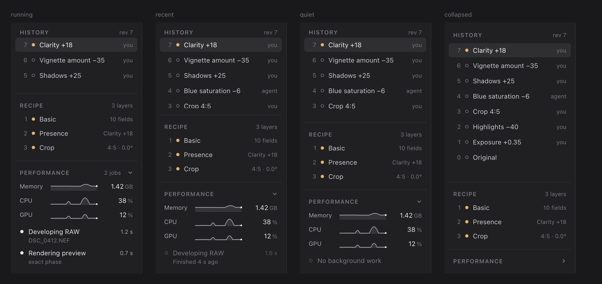

# Performance panel, activity board and resource counters

Status: implemented and verified on the M4 Mac on 2026-09-23, requested by the owner the same day, whose [decisions](#decisions) on its default state and units are recorded below. It adds a Performance section at the bottom of the state panel that shows the editor's own memory, CPU and GPU use with a one-minute sparkline each, and the long-running work in progress. Behind it are two host services with their own API methods: an **activity board** that any worker publishes its work to and any client reads, and **resource counters** that report what the operating system accounts to this process. Neither changes a recipe, history, render or export.

## Why a host inspector and a board, not a tool module and a bus

A tool module in Luxforge is an editing provider: a descriptor, effects, actions and layers ([modules](modules-and-api.md)). A resource monitor has none of those, so it is a host inspector like the histogram, and its data is reachable through ordinary API methods, which is what makes it programmable.

The coupling the owner wants to avoid is between the panel and the things that do work. The panel must not know the preview worker, the source worker, a later exporter or an AI provider, and none of them may know the panel. The **activity board** is the seam: a publisher calls the host's `begin` and gets a guard; a reader takes a snapshot. Publishers and readers share the board's schema and nothing else.

The board holds current state rather than delivering a stream of events, for three reasons:

- A reader that arrives late (the panel opened mid-export, an agent that connects during a RAW redevelopment) needs to know what is running now, not the transitions it missed.
- The existing event log (`events.since`) is a 256-entry record of catalog mutations that clients use to resynchronise. Preview jobs start and finish up to 120 times a second during a drag; routing them through that log would evict the mutations and force full refreshes.
- A snapshot costs one lock and a copy of at most 64 small entries, with no subscriber bookkeeping and no queue to bound per reader.

The board's `sequence` changes whenever its contents change, so a poller can skip an unchanged snapshot. When push notifications exist, the board can announce a coalesced change; nothing here depends on that.

## Scope

In scope: the activity board and `activity.list`; the resource counters and `resources.read`; publishing from the work that exists today (source preparation, RAW redevelopment, preview jobs, owner-side analysis and capability jobs); the Performance section with its sampler; widgets, evidence and measurement.

Out of scope: export and AI jobs, which will publish through the same board when they exist; cancelling work from the panel; per-cache memory attribution; persisting the section's expanded state across launches; GPU time and GPU allocations on Windows and Linux.

## Activity board

`luxforge_core::activity`. One board per catalog owner, created at `OwnerHandle::start_with` and shared as `Arc<ActivityBoard>` with the owner's workers; `OwnerHandle::activity()` hands the desktop the same board for its preview queue.

- `board.begin(spec) -> Activity` records an active entry and returns a guard. `spec` is `{kind, label, detail?, asset_id?, job_id?}`: `kind` is a stable dotted identifier, `label` a short present-participle phrase for people, `detail` an optional second line (a file name), `job_id` the id of a job that `job.status` can also answer, when there is one.
- `activity.phase(&'static str)` and `activity.progress(fraction, message)` update the entry: `fraction` is 0 to 1 when the work knows a truthful extent, `message` a short word for what it is doing (`downloading`, `copying`). Either may be omitted. A capability job's `ModuleContext::progress` is this call, forwarded through its `JobControl`; `module.job.read` answers with the same progress rather than keeping its own copy.
- `activity.finish(outcome)` with `completed`, `cancelled` or `failed` moves the entry to the recent list. Dropping the guard without finishing records `cancelled`, or `failed` when the thread is panicking, so an entry can never outlive its work.
- Bounds: at most 64 active entries; a `begin` past that is still allowed to run, returns a guard that records nothing and increments `untracked`. At most 16 recent entries, newest first, and only work that ran for at least 250 ms enters the recent list, so a drag's preview churn never evicts a RAW redevelopment. The threshold is a board constant that tests may lower.
- Cost: `begin`, `phase` and `finish` each take one uncontended mutex and allocate only the optional detail string. Labels are `&'static str`. No timer, thread or queue is added.

Publishers today:

| Kind | Label | Published by | Detail | Phases |
| --- | --- | --- | --- | --- |
| `source.prepare` | Preparing original | Source worker, `SourceTaskKind::File`, from before the owner marks the job preparing to before it learns the result | File name | none |
| `source.develop` | Developing RAW | Source worker, `SourceTaskKind::Develop` | File name | none |
| `preview.render` | Rendering preview | The preview queue's job thread, from its start to the end of its exact phase, before the exact result is sent | none | `proxy` (when a proxy plan exists), then `exact` |
| `analysis.histogram` | Measuring histogram | The owner's analysis job thread, until before its result is posted | none | none |
| `module.activate` | Activating module | The capability worker's module lane, from the moment it dispatches the job to the moment its result is in | Module ID | none |
| `module.deactivate` | Deactivating module | The capability worker's module lane | Module ID | none |
| `module.resource.install` | Installing resource | The capability worker's transfer lane | `<module ID>/<resource ID>` | none |
| `module.resource.remove` | Removing resource | The capability worker's transfer lane | `<module ID>/<resource ID>` | none |
| `module.task` | Running task | The capability worker's module lane | Module ID | none |

Every entry but `source.prepare` names its `asset_id`; a new import has no asset yet. Capability jobs name no `asset_id`: a task's photo is in its own request, not the board's schema. A source job's `job_id` is the one `job.status` answers, an analysis job's the one `analysis.read` answers, a capability job's the one `module.job.read` answers. Each entry ends before its result reaches a reader, so a client that sees the job finished never still finds it running. A cancelled source job, a superseded or abandoned exact phase and `ErrorKind::Cancelled` end `cancelled`; any other error ends `failed`.

The clipping overlay and preset import are left out: the first is a desktop-local reduction measured in milliseconds, the second runs synchronously on the owner.

### `activity.list`

No parameters (an omitted or empty `params` is accepted and any key is refused, so a misspelt filter is never ignored), no asset required, mutates nothing, emits no event. The owner answers it from its board.

```json
{
  "sequence": 812,
  "active": [
    {"id": 41, "kind": "source.develop", "label": "Developing RAW", "detail": "DSC_0412.NEF",
     "asset_id": "…", "job_id": "job-…", "elapsed_ms": 1204}
  ],
  "recent": [
    {"id": 40, "kind": "preview.render", "label": "Rendering preview", "phase": "exact",
     "outcome": "completed", "duration_ms": 1610, "ended_ms_ago": 4020}
  ],
  "untracked": 0
}
```

Optional keys (`detail`, `asset_id`, `job_id`, `phase`, `progress` as `{"fraction"?, "message"?}`) are omitted when absent. Active entries are oldest first. Times are whole milliseconds computed from monotonic clocks at snapshot time.

## Resource counters

A new leaf crate, `crates/luxforge-process`, holds the platform code. It is the second crate allowed `unsafe` (as `luxforge-raw` is, with `unsafe_op_in_unsafe_fn = "deny"`), keeps every `unsafe` block beside a `SAFETY:` comment and exposes a safe API. It adds no crate that is not already in `Cargo.lock`; direct dependencies are pinned to the locked versions.

| Counter | macOS (owner's M4) | Linux | Windows |
| --- | --- | --- | --- |
| CPU time, all threads, user + system | `proc_pid_rusage` v6, mach ticks converted with `mach_timebase_info` | `/proc/self/stat` `utime + stime` over `sysconf(_SC_CLK_TCK)` | `GetProcessTimes` |
| Memory | `ri_phys_footprint`, kind `footprint`: Activity Monitor's Memory column, which on unified memory includes GPU allocations | `VmRSS`, kind `resident` | `PrivateUsage`, kind `private` |
| Peak memory | `ri_lifetime_max_phys_footprint` | `VmHWM` | `PeakWorkingSetSize` (resident) |
| Resident memory | `ri_resident_size` | `VmRSS` | `WorkingSetSize` |
| GPU time | Sum of `accumulatedGPUTime` (ns) over this pid's `IOAccelerator` user clients in the IORegistry | unavailable | unavailable |
| GPU allocations | `currentAllocatedSize` of the system default Metal device, which is the process-wide device wgpu also uses | unavailable | unavailable |

Two facts were measured on the M4 on 2026-09-23 with a Metal compute probe: `task_power_info_v2.gpu_energy.task_gpu_utilisation` stays 0 on Apple silicon and cannot be used; the IORegistry `AppUsage` entries report nanoseconds (0.80 s against 0.82 s of command-buffer time), and `MTLCreateSystemDefaultDevice` returns the one device object whose `currentAllocatedSize` counts the process's allocations. `AppUsage` is an undocumented key the driver publishes; if it is missing the counter reports unavailable with that reason, never zero. Walking the accelerator's children costs 0.35 ms p50 and 1.1 ms p95 (84 user clients on the owner's machine), so the sampler keeps this process's user-client entries and asks only them on later reads, walking again every 10 s, whether or not it found any, and sooner when a cached client stops answering. Releasing a command queue removes its entry from `AppUsage`, so the sampler folds a vanished entry's last value into a retired total and GPU time never decreases.

The counters belong to the process, not to a catalog owner, so `luxforge_core::resources` keeps one process-wide sampler, as the colour-scratch budget is process-wide. Reading the Metal device creates one in a process that has none, so GPU allocations are read only after the host calls `luxforge_core::resources::declare_gpu_presenter()`: the desktop does at startup, before its first frame; the headless `luxforge-json` owner does not, and reports the reason.

### `resources.read`

No parameters (refused like `activity.list`'s), no asset required, mutates nothing, emits no event. Counters are cumulative, so a client computes a rate from two reads: CPU percent of one core is `100 × Δcpu.time_ns / Δmonotonic_ns`, as Activity Monitor counts it (a 14-core machine can reach 1400%), and GPU percent is the same over `gpu.time_ns`.

```json
{
  "monotonic_ns": 81234567000,
  "cpu": {"time_ns": 5231200000, "logical_cpus": 14},
  "memory": {"kind": "footprint", "bytes": 1523000000, "peak_bytes": 2011000000, "resident_bytes": 980000000},
  "gpu": {"time_ns": 812400000, "allocated_bytes": 312000000, "unified_memory": true},
  "budgets": {
    "colour_scratch": {"target_bytes": 67108864, "in_use_bytes": 0, "peak_bytes": 3145728},
    "spatial": {"target_bytes": 268435456, "in_use_bytes": 0, "peak_bytes": 50331648}
  }
}
```

`monotonic_ns` is only meaningful as a difference. A counter the platform cannot give is omitted, and its object gains `"unavailable": {"<key>": "<reason>"}`, for example `"gpu": {"unavailable": {"time_ns": "GPU time is not reported on Linux yet", "allocated_bytes": "…"}}`. The two budgets are the existing process-wide colour-scratch and spatial targets with their high-water marks; they are exact and cost nothing to read.

`unified_memory` is omitted, with no reason, when no device was read, since it is a property rather than a counter. A read runs on the owner thread: a handful of system calls plus, with the entry cache warm, a few IORegistry property reads, 4 to 8 µs in all ([verification](#verification)). It is bookkeeping, not frame work (performance rule 5). The first read after `declare_gpu_presenter()` opens the Metal device handle: 0.6 ms in the desktop, whose device already exists, and 37 ms in a process that has none.

## Performance section

The last block of the state panel, outside its scrollable so it stays pinned to the bottom while History scrolls above it; a 1 px rule in the band-border colour separates the two. It is open at every launch and **samples only while it is expanded and the state panel is shown** (the developer components gallery, which replaces the workspace, counts as hidden): collapsed, it sets no timer and makes no request, so idle stays asleep (performance rule 8). Expanded, it reads `resources.read` and `activity.list` once a second through one owner task, skips a tick while the previous read is in flight, and keeps the last 60 samples; expanding clears the history and reads at once. Expanded state is local to this client and this launch, like a tools-panel section's; collapsing it is not remembered across launches, which the roadmap tracks. Show performance and Hide performance in the command palette toggle it, and the evidence step `{"performance": {"expanded": …}}` drives it in scripted runs ([development](../engineering/development.md)).



Layout at the panel's 240 pt, inside its 8 pt padding:

| Element | Size | Rule |
| --- | --- | --- |
| Heading | 22 pt | `PERFORMANCE` section label; right-aligned caption (`2 jobs` while long work is active, else empty) and a 10 pt chevron at the far right, down when expanded; the whole row toggles |
| Metric row | 24 pt, three rows: Memory, CPU, GPU | Label, 11 pt secondary in a 48 pt box; the sparkline filling the middle, 16 pt tall; the value, 12 pt primary right-aligned in a 56 pt box with its unit in 10.5 pt tertiary; 8 pt gaps |
| Sparkline | 60 samples, newest at the right edge | 1 px baseline `#313134`; area at 16% of `#a3a3aa`; 1.25 px line `#a3a3aa`; the newest point a 1.75 pt dot `#ececee`. No accent and no colour: the photograph is the only colour on screen. Until 60 samples exist the line starts part-way across |
| Job row | 16 pt label line, 14 pt detail line, optional 2 pt bar | A 6 pt marker (filled `#e8e8ea` running, hollow tertiary finished), the label in 12 pt primary, elapsed on the right in 10.5 pt secondary; the detail line in 10.5 pt tertiary aligned with the label, reading the entry's detail and its phase joined by ` · ` (`DSC_0412.NEF`, `exact phase`), and omitted when it has neither; a determinate progress bar under it only when the entry has progress |
| Bottom | 8 pt | Panel padding |

Values and scales, all derived by pure functions in the view model:

- **Memory** shows `memory.bytes` in binary units with Activity Monitor's labels: `812 MB` below 1 GiB, `1.42 GB` above, `12.4 GB` from 10 GiB. Scale 0 to 110% of the window's largest sample, at least 64 MiB. Tooltip: the kind in words (Activity Monitor's Memory for `footprint`), the peak since launch, resident memory and, on unified memory, the GPU allocations it includes.
- **CPU** shows percent of one core: one decimal below 10% (`3.2%`), whole numbers above (`38%`, `420%`). Scale 0 to the larger of 100% and the window's peak. Tooltip: the convention in words with the machine's ceiling (`14 cores: 1400%`) and the window's peak.
- **GPU** shows percent of GPU time the same way, scale 0 to 100%. Tooltip: the window's peak and the GPU allocations. When a counter is unavailable the row shows `–`, draws only its baseline and its tooltip gives the reason.
- CPU and GPU need two samples; the first second after expanding shows `–` for both.
- **Jobs**: every active entry that has run for at least 500 ms, oldest first, at most four and then a `+N more` caption; when there is none, the newest recent entry that ran for at least 500 ms and ended within the last 10 s, dimmed with a hollow marker, its duration on the right and `Finished 4 s ago` (or `Cancelled`, `Failed`) as its detail; otherwise one dimmed `No background work` row. There is always at least one job line, and a job line without a detail keeps an empty detail line beneath it, so the section's height changes only when two or more long jobs overlap. Elapsed reads `0.8 s`, `12 s`, `1 min 4 s`.

At one sample a second, a job shorter than about a second may never be seen running; it is still in `activity.list` and appears here as finished. The 500 ms display threshold is a view rule; the API reports every active entry.

## Performance rules checklist

- **Original reads and decodes:** none added.
- **Full-frame allocations:** none. The board holds at most 80 small entries; the desktop keeps 60 samples of a few integers.
- **Point queries:** none added.
- **Owner thread:** `resources.read` (system calls and IORegistry reads, measured) and `activity.list` (one lock and a copy). No frame work.
- **Desktop messages:** a tick every second while the section is expanded, one owner task per tick, and a re-derivation of the state panel; no `asset.state`, `history.list`, preview job or upload.
- **Timers:** one, gated on the section being expanded and the state panel shown; its interval is the sparkline's resolution. Its cost is measured as idle CPU with the section expanded and collapsed.
- **Timing:** `editor-latency` Exposure drag before and after, since every preview job now begins and finishes one activity.

## Acceptance

- Core: board unit tests for begin, phase, finish, drop-as-cancelled, panic-as-failed, the 64-entry cap with `untracked`, the recent threshold and cap, and `sequence` changing exactly when contents change; an owner test that a source preparation and an analysis job appear in `activity.list` while running (held by a test gate, not a sleep) and in `recent` afterwards; a preview-queue test that a job's activity reports `proxy` then `exact` and ends when the queue releases it. Both methods are in `schema.list` with notes, need no asset and emit no event.
- Counters: tests that CPU time grows after spinning a thread for 200 ms by at least 150 ms; that footprint (or resident memory) grows by at least 48 MiB after touching a 64 MiB allocation; that peak is at least current; on macOS, that a `wgpu` or Metal dispatch raises GPU time and GPU allocations when a Metal device exists, and that the headless configuration reports allocations unavailable with a reason. Linux and Windows code compiles in the hosted CI matrix; no native run is claimed.
- Desktop: view-model tests for rates from counter pairs, every formatter's boundaries, the scale rules, the job display rules and the unavailable row; the section's timer exists only while expanded and the state panel is shown; widgets have pure geometry tests (sparkline points, clamping of non-finite and out-of-range values, an empty series) and gallery states.
- Rendered: a `performance` smoke scenario on the owner's M4 that captures the collapsed heading, the expanded section after at least three samples, a finished long job and the collapsed section again, and checks each frame's recorded samples against the displayed text, the rates against the recorded counters, the job rows against the recorded `activity.list`, the sample count unchanged while collapsed, and the memory figure against an independent reading of the same process taken by the runner.
- Measured and recorded in [performance](../specs/performance.md): the owner-side cost of each method, idle CPU with the section collapsed and expanded, and the Exposure drag before and after.

## Verification

On the owner's M4 Mac, 2026-09-23, release builds:

- `cargo xtask check` passes: the board's unit tests (active to recent with its last phase, drop as cancelled, panic as failed, the 64-entry cap and `untracked`, the threshold and the 16-entry cap, `sequence` changing exactly with the contents, the JSON shape), an owner test that holds a source preparation and an analysis job at test gates while `activity.list` lists them and then reads them as recent, preview-queue tests for `proxy` then `exact` and for a superseded job ending `cancelled`, the counters' tests (CPU time grows by at least 150 ms over a 200 ms spin and falls within `getrusage`'s readings; footprint grows by at least 48 MiB after touching 64 MiB; a 256 MiB Metal buffer raises GPU allocations by at least its size; a blit raises GPU time to within 4× of Metal's own command-buffer time, and releasing the queue never lowers it; a headless process reports both GPU counters unavailable with their reasons), both methods through the method table and the owner, and the desktop's view-model, gate and sampler tests.
- `verify --tier rendered` passes with every smoke scenario. `smoke --scenario performance` opens the generated 60 MP JPEG and captures eight frames: opened with the section open and sampling, after 3.6 s, a 16:9 straighten at 3°, Presence Clarity 100 over it (an exact render of about 1 s, listed running as "Rendering preview · exact phase" and then as finished), 2.5 s later, collapsed, 2.5 s later with the reads and samples unchanged, and opened again on the first read of a fresh window. The runner re-derives every displayed figure, series length and job row from the recorded `resources.read` and `activity.list` answers without the editor's code, requires footprint memory with GPU time and unified GPU allocations, and checks each expanded frame's resident memory and footprint against its own `ps` and `footprint` readings of the same process taken just before and after the sample: they agree to the byte while the editor idles. With `--source` the owner's X100VI RAF it lists "Preparing original" and "Developing RAW" as finished; a live Developing RAW frame was not caught, because the one-second read landed after the 1.4 s development ended in both runs.
- Timing, idle CPU and each method's cost are in [performance](../specs/performance.md#performance-section-activity-board-and-resource-counters): no drag regression; the expanded section costs 0.3 to 0.6% of one core and the collapsed one nothing; each method answers in a few microseconds.

Not verified: native Linux and Windows runs (their counters compile, and the unavailable rows are unit-tested); the `+N more` caption and the tooltips in a rendered frame (unit-tested); the heading's hover, which no scripted step moves the pointer over.

## Decisions

Decided by the owner on 2026-09-23, after reviewing the built section:

- **Default state.** The section starts open on every launch. Its one-second sampler therefore runs in an ordinary session and counts in the idle figure (0.3 to 0.6% of one core, [measured](../specs/performance.md#performance-section-activity-board-and-resource-counters)); collapsing it or hiding the state panel stops it.
- **Units.** Binary sizes with Activity Monitor's MB and GB labels, and CPU as a percentage of one core, so it passes 100% whenever more than one core is busy.
