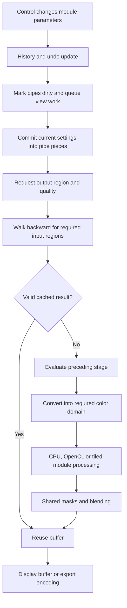

# Pixelpipe and rendering

[Knowledge base index](README.md) · Source baseline: 5.6.1.

## The executable processing model

**S.** A development session has module instances and several pixelpipes. Each pipe has its own module pieces (`dt_dev_pixelpipe_iop_t`) containing processing-ready data, ROI, enabled state, blend settings and capability flags. User parameter structs are committed into this per-pipe state before evaluation. This avoids making a long-running pixel operation read a changing GUI parameter struct directly. [Pipe synchronization](https://github.com/darktable-org/darktable/blob/03179f8e080aa9cedebfe14b098b7ba88940a292/src/develop/pixelpipe_hb.c#L665) [Developer module guide](https://github.com/darktable-org/darktable/blob/03179f8e080aa9cedebfe14b098b7ba88940a292/dev-doc/IOP_Module_API.md#L1)

**C.** The following trace combines verified call paths into a readable model; some modules add automatic analysis or other dependencies:

## From an adjustment to reprocessing

**S.** `dt_dev_add_history_item()` reaches a common routine that updates history/undo bookkeeping, marks image changes and invalidates view pipes. The history update distinguishes a changed top item from broader synchronization. `dt_dev_process_image()`, preview and second-preview counterparts enqueue work for their view workers. The worker subsequently calls pipe change/synchronization and processing. [History updates](https://github.com/darktable-org/darktable/blob/03179f8e080aa9cedebfe14b098b7ba88940a292/src/develop/develop.c#L1176) [View jobs and invalidation](https://github.com/darktable-org/darktable/blob/03179f8e080aa9cedebfe14b098b7ba88940a292/src/develop/develop.c#L275) [Pipe synchronization](https://github.com/darktable-org/darktable/blob/03179f8e080aa9cedebfe14b098b7ba88940a292/src/develop/pixelpipe_hb.c#L665)

**S.** `commit_params()` is the preparation boundary: an EV setting can become a scale factor, a curve can become a table, and a module can decide whether its selected mode supports OpenCL or tiling. This is separate from applying those prepared values to every pixel. [Developer module guide](https://github.com/darktable-org/darktable/blob/03179f8e080aa9cedebfe14b098b7ba88940a292/dev-doc/IOP_Module_API.md#L1) [Exposure](https://github.com/darktable-org/darktable/blob/03179f8e080aa9cedebfe14b098b7ba88940a292/src/iop/exposure.c#L468) [Local contrast](https://github.com/darktable-org/darktable/blob/03179f8e080aa9cedebfe14b098b7ba88940a292/src/iop/bilat.c#L293)

**P.** For Lightwell, preserve this distinction between durable intent and derived execution data while retaining the existing core-owned command/history service. A slider widget should not become the only entry point to an edit.

## Render order is not history order

**S.** `src/common/iop_order.c` contains explicit order tables for legacy, v3.0 and v5.0 arrangements, including RAW/JPEG variants. A representative subsequence in v5.0 RAW is:

`sensor normalization → white balance → highlight reconstruction → demosaic → profiled denoise → lens/geometry → exposure → tone equalizer → input profile → later color/detail/rendering → output`

This is a **selected subsequence**, not every active operation, and listed modules need not all be enabled. Tone equalizer's placement before the input profile is significant: some useful operations run in camera RGB, not the eventual working RGB. [Processing order](https://github.com/darktable-org/darktable/blob/03179f8e080aa9cedebfe14b098b7ba88940a292/src/common/iop_order.c#L298)

**D.** The UI's processing-module order represents execution order; moving eligible modules can change output. Early sensor/color dependencies restrict movement. The history panel records editing chronology instead. [Pixelpipe and order](https://docs.darktable.org/usermanual/5.6/en/darkroom/pixelpipe/the-pixelpipe-and-module-order/)

**C.** Thus two sessions with identical visible sliders can differ if instance count, module order, enabled states, masks, profiles or algorithm versions differ. An interchange representation needs that full state, not just a map of familiar names to numbers.

## Region requests run backward, pixels run forward

**S.** `_dev_pixelpipe_process_rec()` asks a module's `modify_roi_in()` which upstream rectangle is needed for the requested output. It recursively obtains that input, selects an output format and processing path, and then blends. Point operations can often reuse the same ROI; a warp needs inverse-mapped input and filter support; repair may need a source patch outside the visible destination. [Pixelpipe evaluator](https://github.com/darktable-org/darktable/blob/03179f8e080aa9cedebfe14b098b7ba88940a292/src/develop/pixelpipe_hb.c#L1757) [Shared blending](https://github.com/darktable-org/darktable/blob/03179f8e080aa9cedebfe14b098b7ba88940a292/src/develop/blend.c#L458)

**C.** For a 100% pan, this can avoid recomputing an entire image. It is not a guarantee that every module is local: global statistics, large pyramids and some reconstruction methods require broader data. A bounding rectangle may also include many pixels not individually needed by a nonlinear mapping.

**S.** The evaluator checks shutdown state at intermediate boundaries. This supports stopping obsolete work, but the responsiveness of cancellation also depends on how long a module runs between checks. It does not prove constant cancellation latency for an expensive kernel or inference call. [Pixelpipe evaluator](https://github.com/darktable-org/darktable/blob/03179f8e080aa9cedebfe14b098b7ba88940a292/src/develop/pixelpipe_hb.c#L1757)

## Caching follows dependency state

**S.** The cache's cumulative hash includes image identity; pipe mode/detail-mask state when applicable; input, working, output and export profile information; included upstream module-piece hashes; requested ROI; and detail-mask hash. Color-picker requests can add their sampling coordinates. Disabled/skipped nodes receive explicit handling. [Pixelpipe cache keys](https://github.com/darktable-org/darktable/blob/03179f8e080aa9cedebfe14b098b7ba88940a292/src/develop/pixelpipe_cache.c#L103)

**C.** This explains why changing a crop, profile or upstream exposure may invalidate apparently unrelated later results. It also explains why the same recipe at Fit and 100% is not automatically the same cache entry. A cache hit is valid only within the implementation's complete identity contract.

**S.** The cache stores host buffers and descriptors, with invalidation/importance/resource accounting. The header explicitly distinguishes this from retaining `cl_mem` device objects as the persistent cache. A running pipe may still pass GPU buffers between stages. [Pixelpipe cache storage](https://github.com/darktable-org/darktable/blob/03179f8e080aa9cedebfe14b098b7ba88940a292/src/develop/pixelpipe_cache.h#L33) [Pixelpipe evaluator](https://github.com/darktable-org/darktable/blob/03179f8e080aa9cedebfe14b098b7ba88940a292/src/develop/pixelpipe_hb.c#L1757)

## Display and export share modules, not necessarily every approximation

**S.** Export uses the image-processing infrastructure, with an export pipe and output-specific color/size/encoding choices. [Export implementation](https://github.com/darktable-org/darktable/blob/03179f8e080aa9cedebfe14b098b7ba88940a292/src/imageio/imageio.c#L991) **D.** Standard interactive, thumbnail, fast and high-quality processing modes make different quality/performance tradeoffs. [Pixelpipe and order](https://docs.darktable.org/usermanual/5.6/en/darkroom/pixelpipe/the-pixelpipe-and-module-order/)

**U.** Shared source code alone does not guarantee pixel-identical display and export. Scaling stage, ROI boundaries, selected approximations, profiles, precision and output encoding can differ. The [performance chapter](previews-and-performance.md) identifies concrete examples worth testing.
