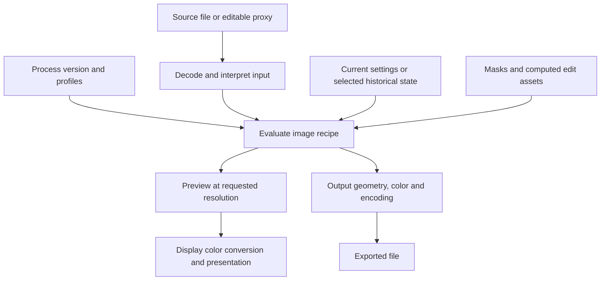

# Rendering, process versions and color

[Knowledge base index](README.md) · Evidence checked 2026-09-20.

## A renderer evaluates settings

**D/H.** Adobe's Texture engineer explicitly describes Camera Raw as both the Photoshop plugin and the imaging engine behind Lightroom editing. The same family of processing technology therefore underpins multiple Adobe interfaces; that does not imply identical UI features or release timing. [S18: Introducing the Texture Control](https://blog.adobe.com/en/publish/2019/05/14/from-the-acr-team-introducing-the-texture-control)

**C.** This diagram is a dependency model, not Adobe's private execution order:

For RAW, interpreting the input can involve sensor decoding, demosaicing and camera color interpretation. For JPEG, those decisions are already baked into RGB samples. Optional learned processing can change this decomposition; joint denoise/demosaic is an example. [RAW chapter](raw-and-computational-tools.md).

## Three different meanings of order

1. **Interaction order:** the chronology of user actions and saved history.
2. **Processing dependencies:** which input each calculation needs and which results become stale.
3. **Recommended workflow:** the order in which Adobe suggests making decisions to avoid rework.

**C.** A settings-based renderer need not apply slider edits in mouse-event order. However, “all edits commute” is too strong: automatic analysis, sampled repair regions, derived sources and masks can depend on a preceding image state. Equal visible slider values also need not imply equal hidden/auxiliary state.

**D.** Adobe recommends Enhance before removal, then Lens Blur, lens profiles, geometry, adaptive profiles, global edits and masking. This is workflow guidance, not an exposed list of internal kernels. [S09: Optimize performance](https://helpx.adobe.com/lightroom-classic/desktop/technical-support/performance-guidelines/optimize-performance-lightroom.html) Adaptive profiles may need updating after repair, rotation/flip or Lens Blur, demonstrating explicit state dependencies. [S16: Image tone and color](https://helpx.adobe.com/lightroom-classic/desktop/process-and-develop-photos/image-tone-color.html)

**H.** The reflection-removal engineering account provides a rare concrete detail: its model operates on original uncropped, unadjusted input; orientation should be corrected first. This describes that ACR feature at launch, not every Lightroom operation. [S38: Removing window reflections](https://blog.adobe.com/en/publish/2024/12/12/removing-window-reflections-adobe-camera-raw)

## Process version is part of the interpretation

**D.** Adobe ties available controls and rendering to the Process Version. PV2012 introduced the revised tone controls and high-contrast tone mapping; PV5 changed negative Dehaze and low-light rendering; PV6 reduces Color/B&W Mixer banding. An upgrade can visibly change an existing photo. These are image-processing versions, separate from catalog upgrades and application version numbers. [S07: Develop module options](https://helpx.adobe.com/lightroom-classic/desktop/process-and-develop-photos/develop-module-options.html)

**P.** Luxforge should record its own algorithm/recipe interpretation marker where needed to protect saved work. That is an internal data-integrity mechanism already allowed by project policy, not a public compatibility framework or a commitment to emulate Adobe process versions.

## Color has multiple boundaries

**D.** Adobe describes Develop previews using ProPhoto RGB, while Library previews use Adobe RGB. Display profiles translate to the monitor; output conversion uses a selected destination profile. Those user-facing descriptions do not specify the encoding or precision of every intermediate buffer. [S14: Color management](https://helpx.adobe.com/lightroom-classic/desktop/workspace/color-management.html)

**D.** Camera-generated embedded previews can differ from Adobe-rendered previews because they use different rendering settings. Camera Matching profiles seek the camera's appearance; they are not evidence of identical proprietary camera processing. [S15: Color FAQ](https://helpx.adobe.com/lightroom-classic/desktop/technical-support/technical-issues/miscellaneous-issues/color-faq.html)

**C.** Four items must remain distinct:

- **Camera profile:** interpretation of RAW camera color and baseline appearance.
- **Working representation:** the color coordinates and transfer function used by an operation.
- **Display transform:** mapping a result to the monitor/compositor contract.
- **Export profile:** color meaning of the pixels written to the output file.

Assigning an ICC tag is not equivalent to converting the pixels. An untagged screenshot is not a reliable numerical reference for a wide-gamut render. A histogram displayed in a perceptual encoding does not prove the image kernels use that same encoding. Claims that everything is “16-bit ProPhoto” or “32-bit linear Melissa RGB” need more precise evidence than the retrieved Help pages provide.

## Preview, export and HDR

**D.** Export can convert and tag output color, resize, and apply media/resolution-dependent sharpening in addition to Develop sharpening. Exporting Original is a different path; RAW metadata accompanies the original rather than baking its appearance into standard RGB output. [S32: Export files](https://helpx.adobe.com/lightroom-classic/desktop/export-photos/export-files-disk-or-cd.html)

**D.** HDR editing/output extends display brightness above SDR and has specific supported views. HDR merge is a separate multi-image operation. The cited output guide lists HDR-capable loupe/compare views but excludes Grid and filmstrip thumbnails. [S31: HDR editing and output](https://helpx.adobe.com/lightroom-classic/desktop/process-and-develop-photos/hdr-output.html)

**U.** The complete ordering of profile transforms, curves, local/global tone, geometry and sharpening; the resampling kernels; numerical precision per stage; and CPU/GPU equality tolerances are not established here. A fixed diagram of all these internals would overstate the available evidence.
